# Pointers

* A variable declared inside a
function is usually stored in the
stack .

* A variable declared outside a
function is stored in globals .

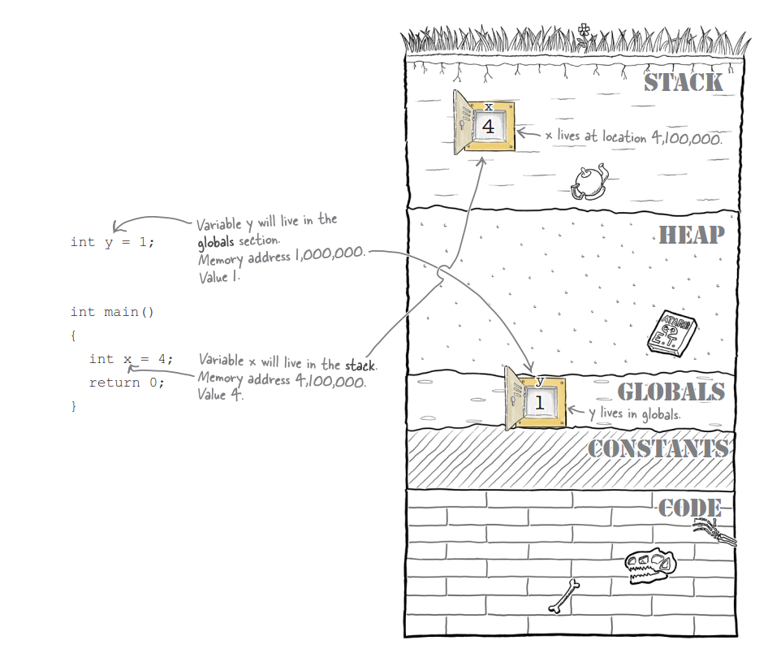

```c

int doses[] = {1, 3, 2, 1000};

printf("Issue dose %i", 3[doses]); // returns 1000

// doses[3] == *(doses + 3) == *(3 + doses) == 3[doses]
```

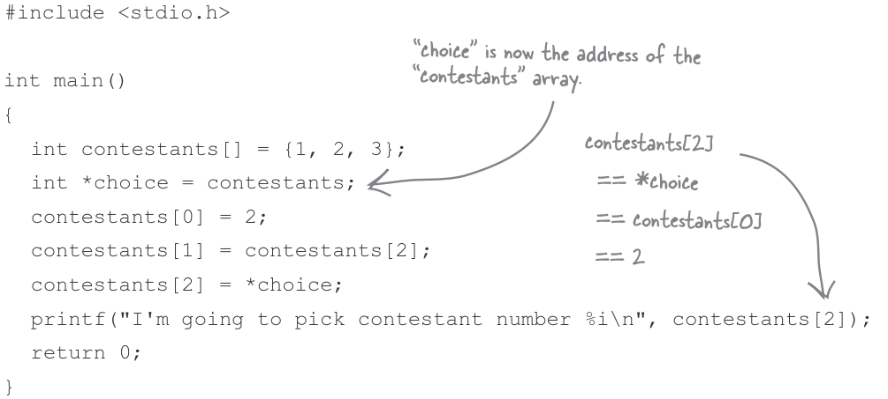

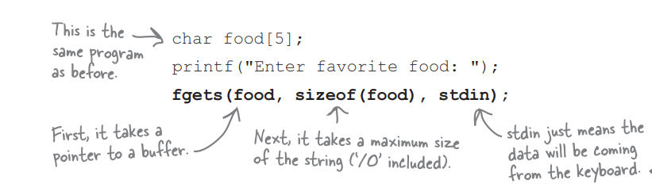
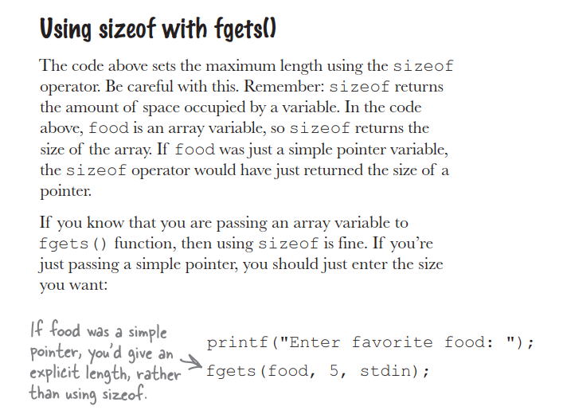
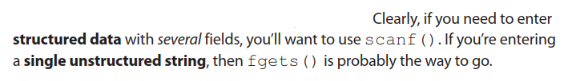

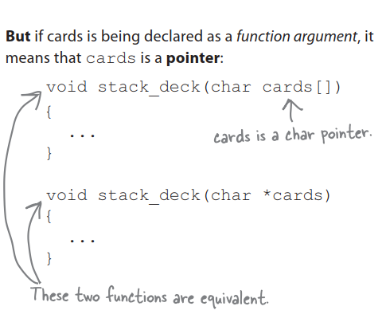
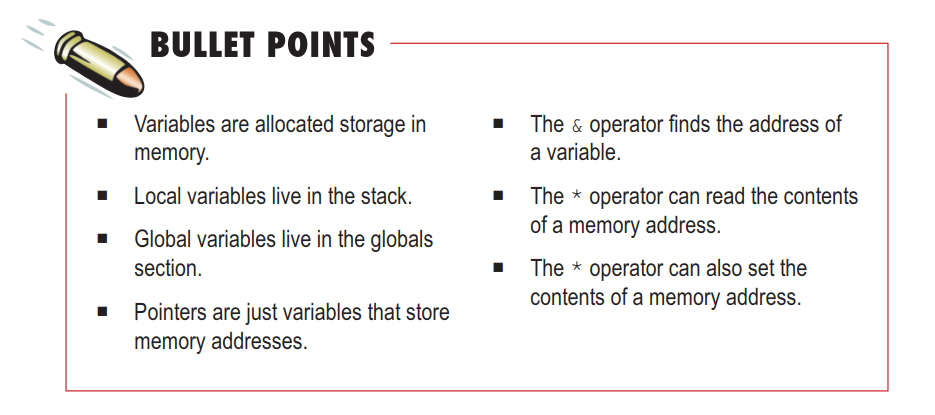
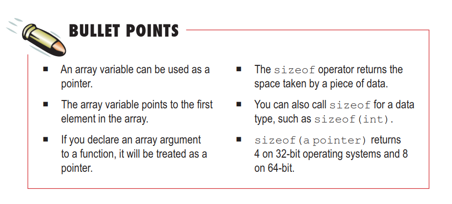
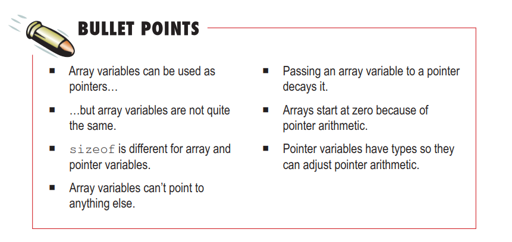
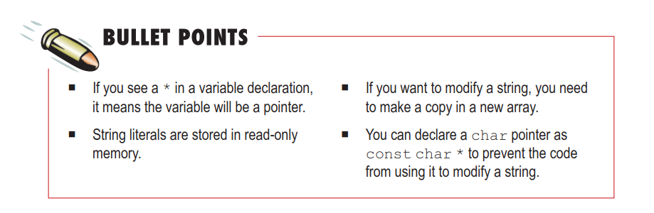
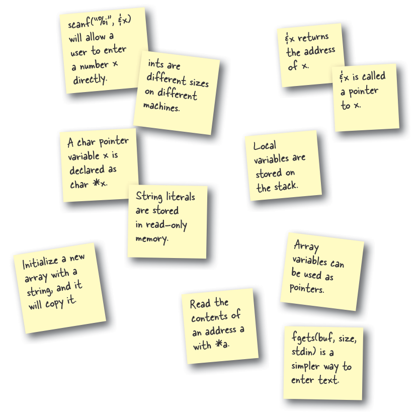
