# Creating Small Tools


* Tools that read data line by line, process
it, and write it out again are called
**filters**.

```bash
echo $?  # this outputs the return of the program
```
* redirect gps_device.data into stdin and redirect the output of the program to output.json
```bash
./JSON < gps_device.data > output.json
./JSON < err_gps_device.data > output.json 2> errorBoard.txt  # you can output the error into another file by using 2>
```

#### Normally, when program runs
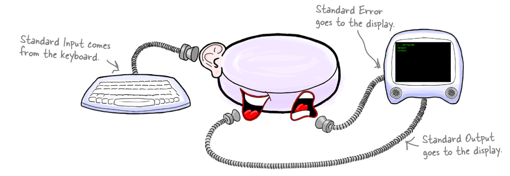
#### When we redirect
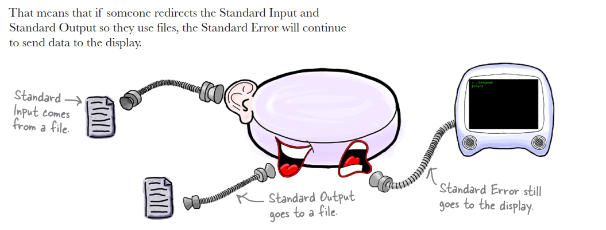

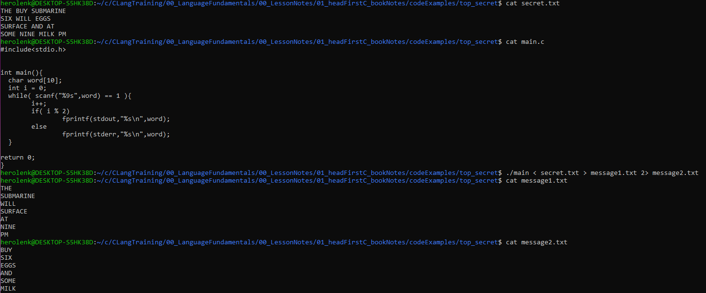

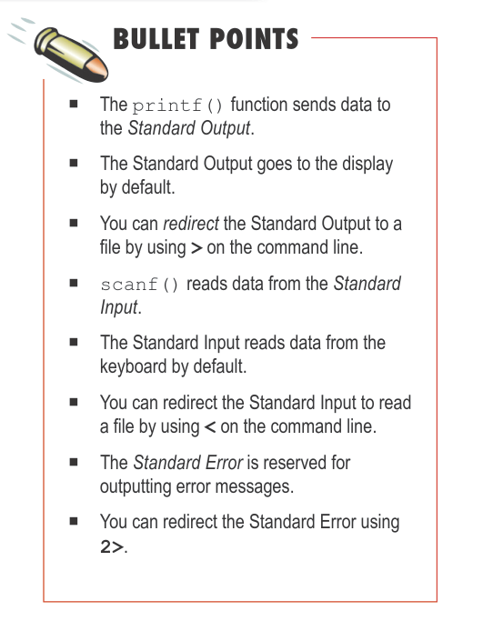
---

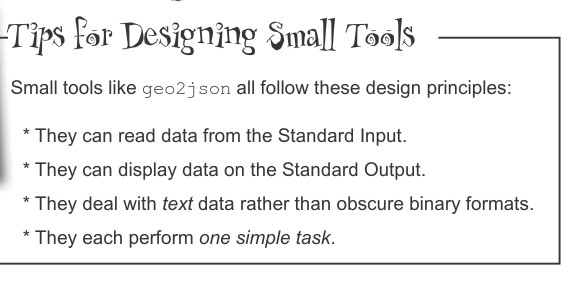

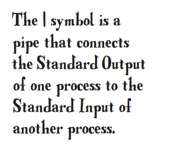

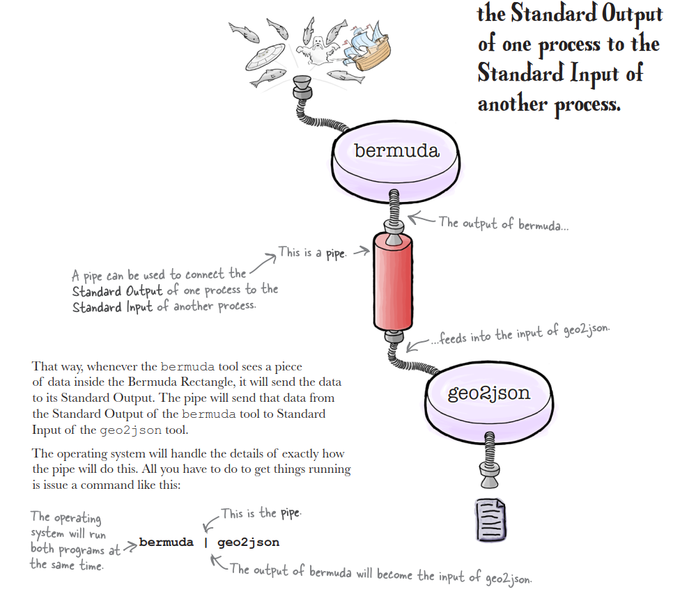

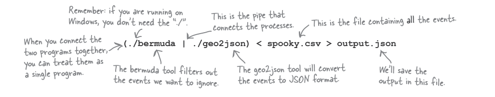

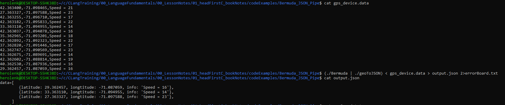

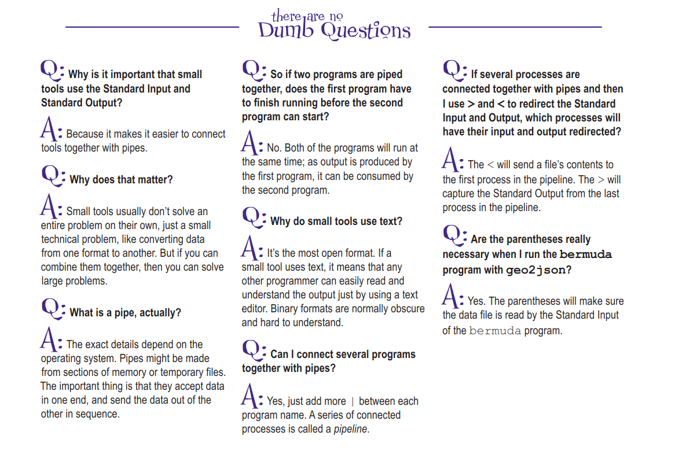

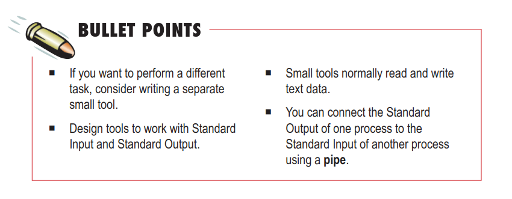

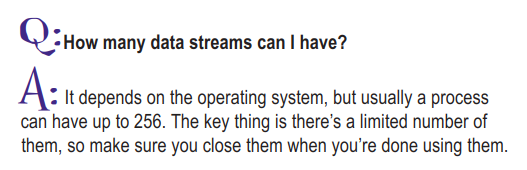

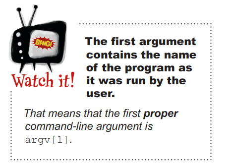

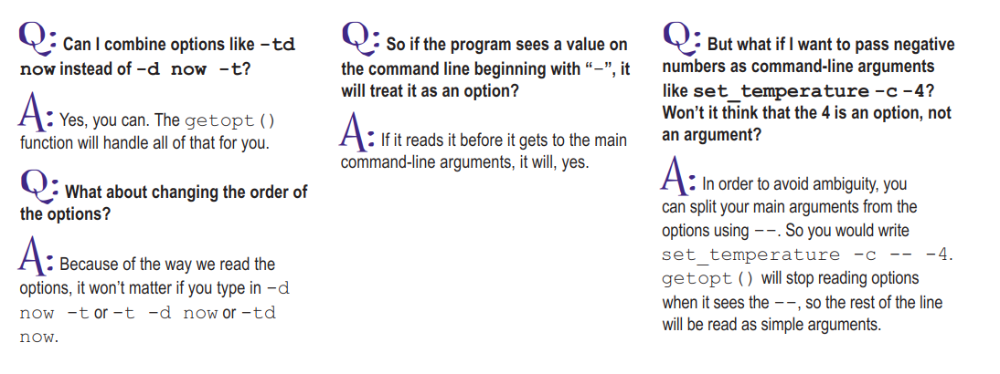


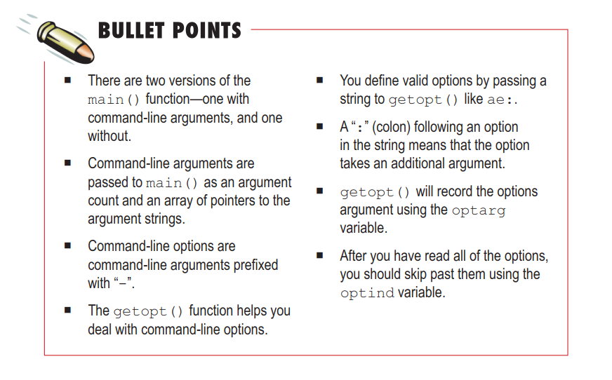

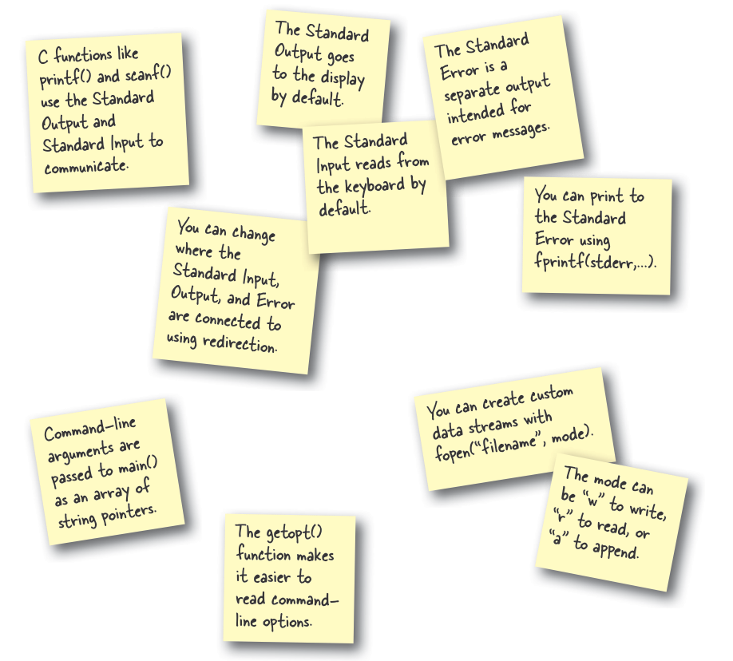
