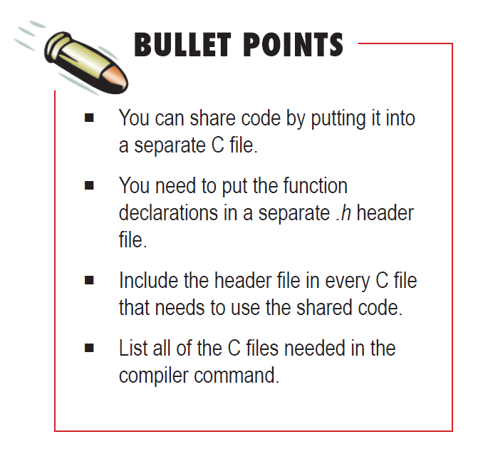
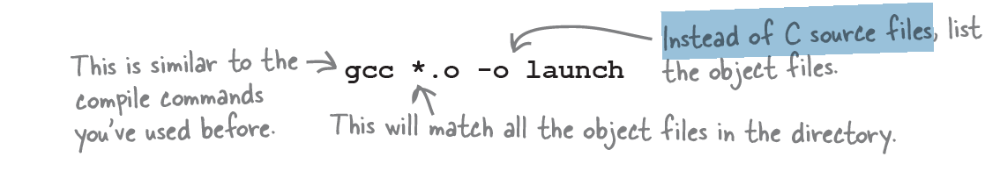
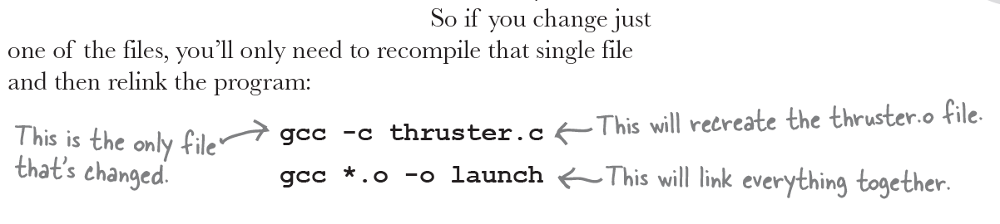
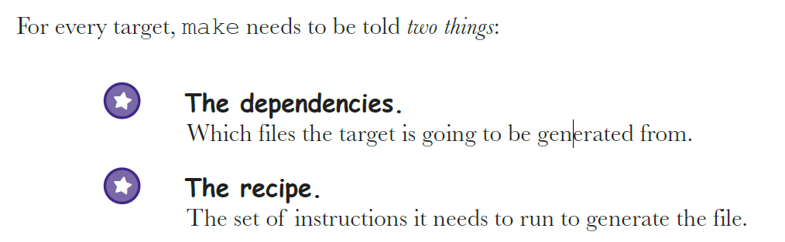
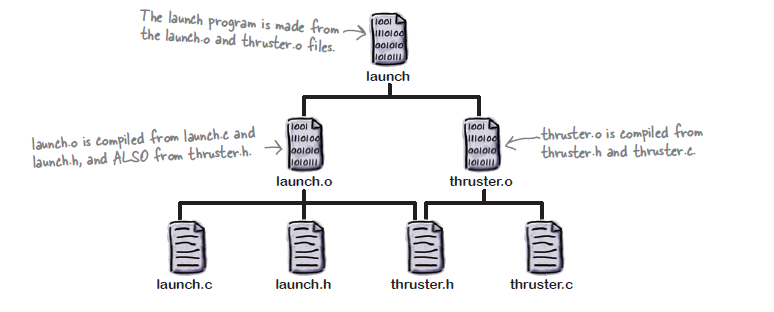
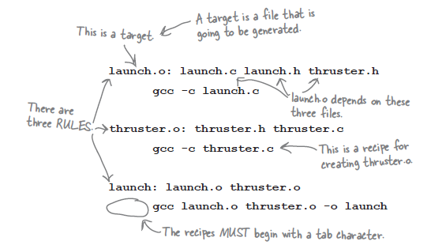
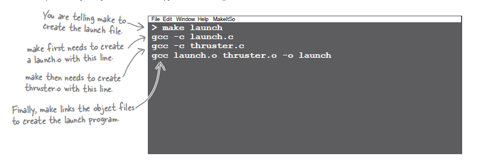
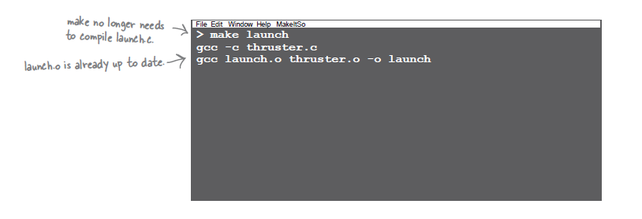
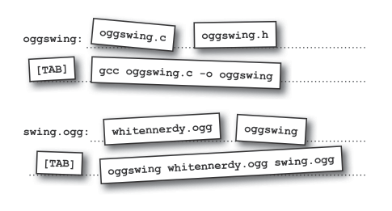
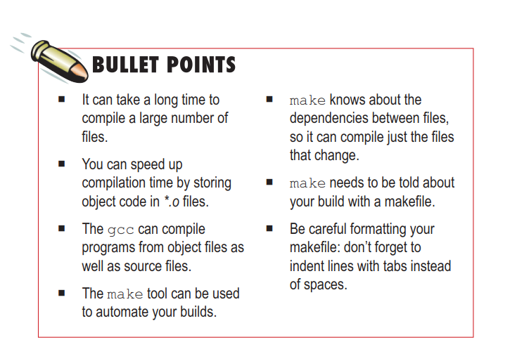

# Compiling more than one file

### Compile all the source files

### Then Link Them Together

### If you can one of the files

## Makefile

Every file that make compiles is called a target.Strictly speaking, make isn’t limited to compiling files. A target is any file that is generated from some other files. So a target might be a zip archive  that is generated from the set of files that need to be compressed.

Together, the dependencies and the recipe form a rule. A rule tells
make all it needs to know to create the target file.

### Makefile Example 1

### Makefile Example 2

