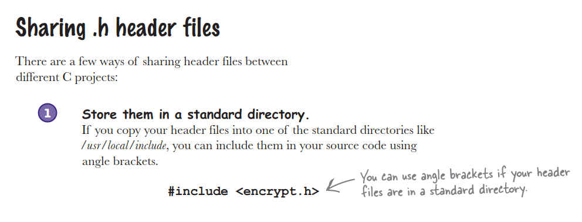
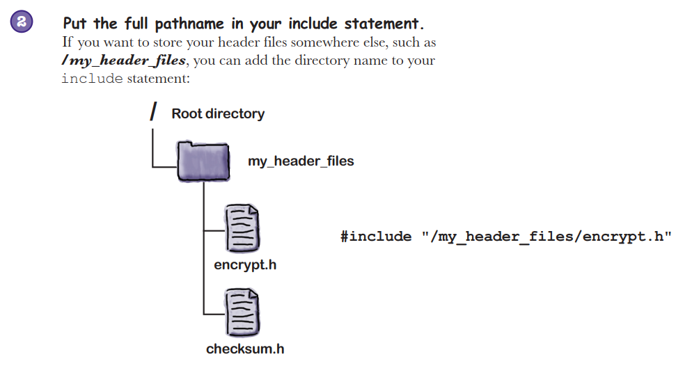
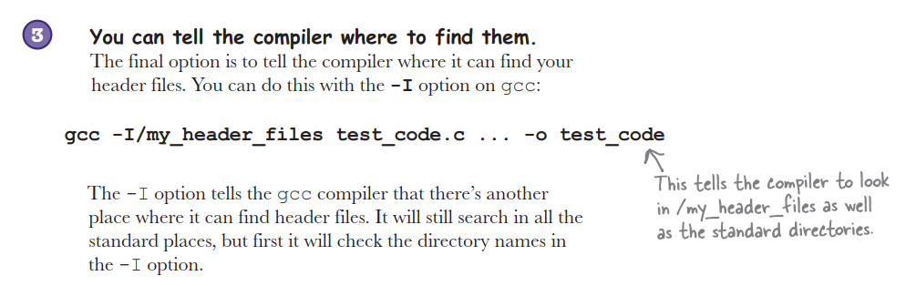
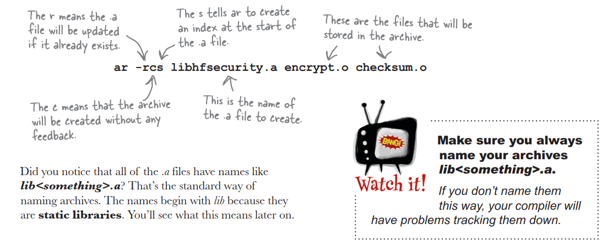
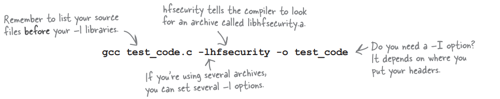

# Static And Dynamic Libraries

```c

void encrypt(char* message){
	
	while(*message){
		*message = *message + 31;
		message++;
	}

}

int checksum(char* message){
	int c = 0;
	
	while(*message){
		c += c ^ (int)(*message);
		message++;
	}

	return c;
}

```





### Make your own archieve

* (`ar`) archive command will store a set of object files in an archive file.
```bash
ar -rcs libhfsecurity.a encrypt.o checksum.o
```



### Store your archive

* You can put your .a file in a standard
  directory like /usr/local/lib.
* Or you can put the .a file in some other directory.
    * If you are still developing your code, or if you don’t feel comfortable installing your code in a system directory, you can always create your own library directory.

### Compile your archives


```bash
# if your archive is inside of another directory other than standard directory.
gcc test_code.c -L/my_lib -lhfsecurity -o test_code
```
