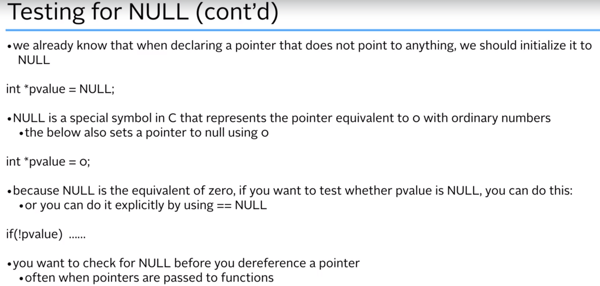
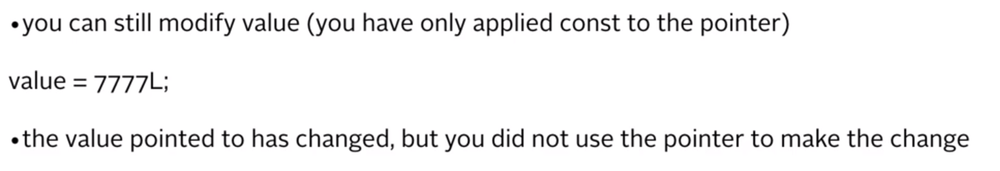
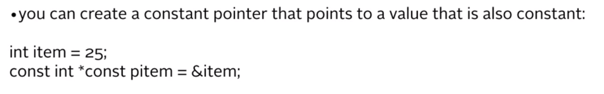
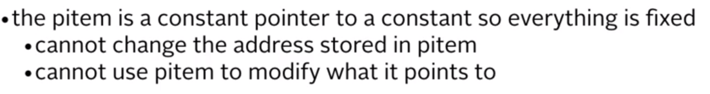

# Pointers



## Pointers To Constants

```c
long value = 999L;
const long *pvalue = &value;    // define a pointer to a constant

*pvalue = 888L; // Error - attempt to change const location.
```





## Constant Pointers

You might also want to ensure that the address stored in a pointer can not be changed.

This time you put the const keyword after the data type and after the asterisk.

```c
int count = 43;
int *const pcount = &count;

int newCount = 44;
pcount = & newCount // Error - attempt to change constant pointer.
// error: assignment of read-only variable 'pcount'
```

---




