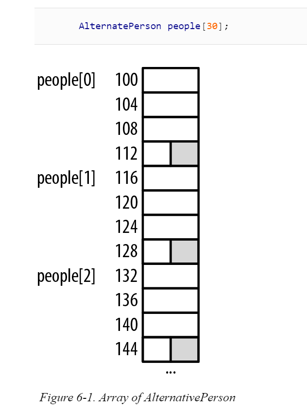
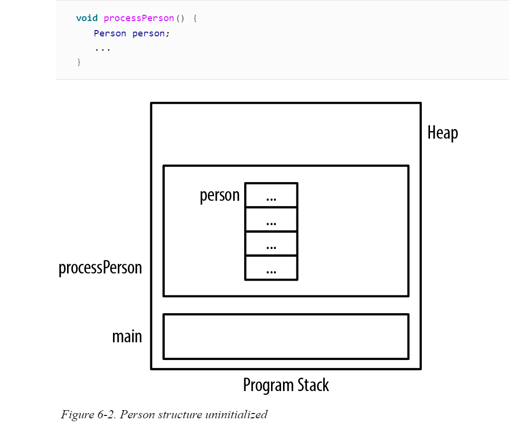
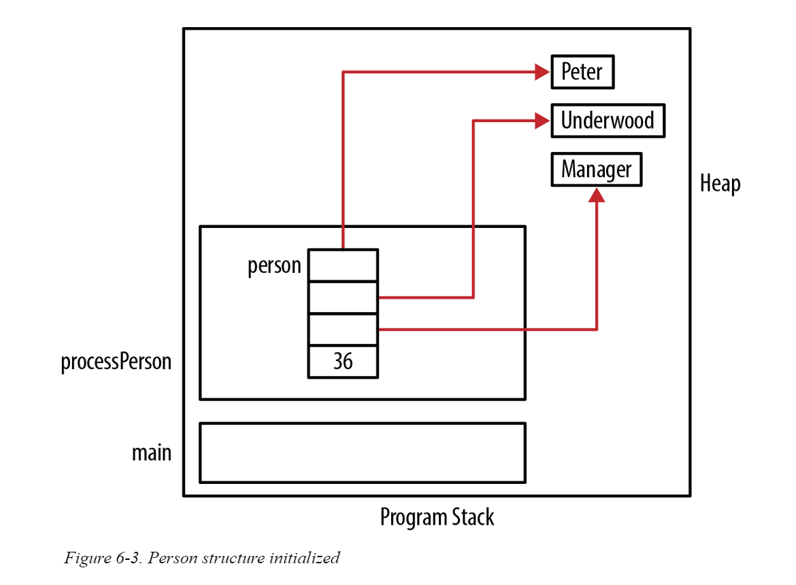
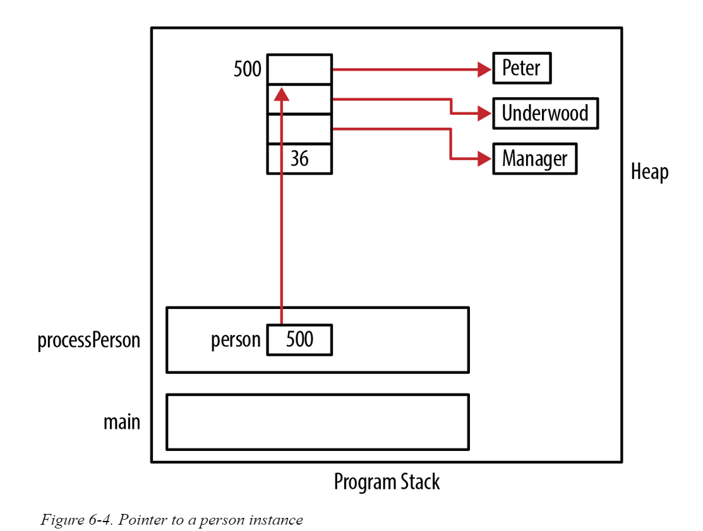

# Pointers And Structures

## HOW MEMORY IS ALLOCATED FOR A STRUCTURE

When a structure is allocated memory, the amount allocated to the structure is at minimum the sum of the size of its individual fields. 

However, the size is often larger than this sum because padding can occur between fields of a structure. This padding can result from the need to align certain data types on specific boundaries. 
* For example, a short is typically aligned on an address evenly divisible by two while an integer is aligned on an address even divisible by four.

```c
typedef struct _person {
    char* firstName;
    char* lastName;
    char* title;
    unsigned int age;
} Person;

int main(){

 Person *ptrPerson;
 ptrPerson = (Person*)malloc(sizeof(Person));
 ptrPerson->firstName = (char*)malloc(strlen("Emily")+1);
 strcpy(ptrPerson->firstName,"Emily");
 ptrPerson->age = 23;
    
    
    return 0;
}
```

* For example, when an instance of the Person structure presented in the previous section is allocated memory, it will be allocated 16 bytes—4 bytes for each element. 

* The following alternate version of Person uses a short instead of an unsigned integer for age. This will result in the same amount of memory being allocated. This is because two bytes are padded at the end of the structure:

```c
typedef struct _alternatePerson{
    char* firstName;
    char* lastName;
    char* title;
    short age;  
} AlternatePerson;
```

```c
    Person person;
    AlternatePerson otherPerson;
    
    printf("%d\n",sizeof(Person));           // Displays 16
    printf("%d\n",sizeof(AlternatePerson));  // Displays 16
```

If we create an array of AlternatePerson, as shown below, there will be padding between the array’s elements.



## Structure Deallocation Issues

When memory is allocated for a structure, the runtime system will not automatically allocate memory for any pointers defined within it.

Likewise, when the structure goes away, the runtime system will not automatically deallocate memory assigned to the structure’s pointers.

Consider the following structure:
```c
typedef struct _person {
    char* firstName;
    char* lastName;
    char* title;
    uint age;
} Person;
```



During the initialization of this structure, each field will be assigned a value. The pointer fields will be allocated from the heap and assigned to each pointer:

```c
void initializePerson(Person *person, const char* fn, 
    const char* ln, const char* title, uint age) {
    person->firstName = (char*) malloc(strlen(fn) + 1);
    strcpy(person->firstName, fn);
    person->lastName = (char*) malloc(strlen(ln) + 1);
    strcpy(person->lastName, ln);
    person->title = (char*) malloc(strlen(title) + 1);
    strcpy(person->title, title);
    person->age = age;
}
```

```c
void processPerson() {
   Person person;
   initializePerson(&person, "Peter", "Underwood", "Manager", 36);
    ...
}
int main() {
   processPerson();
   ...
}
```



Since this declaration was part of a function, when the function returns the memory for person will go away.
* However, the dynamically allocated strings were not released and are still in the heap. Unfortunately, we have lost their address and we cannot free them, resulting in a memory leak.

* When we are through with the instance, we need to deallocate the memory. The following function will free up the memory we previously allocated when we created the instance:

```c
void deallocatePerson(Person *person) {
    free(person->firstName);
    free(person->lastName);
    free(person->title);
}
```

* This function needs to be invoked before the function terminates:

```c
void processPerson() {
   Person person;
   initializePerson(&person, "Peter", "Underwood", "Manager", 36);
    ...
   deallocatePerson(&person);
}
```

* Unfortunately, we must remember to call the initialize and deallocate functions. The automatic invocation of these operations against an object is performed in object-oriented programming languages such as C++.

* If we use a pointer to a Person, we need to remember to free up the person as shown below:

```c
void processPerson() {
    Person *ptrPerson;
    ptrPerson = (Person*) malloc(sizeof(Person));
    initializePerson(ptrPerson, "Peter", "Underwood", "Manager", 36);
      ...
    deallocatePerson(ptrPerson);
    free(ptrPerson);
}
```




## Avoiding malloc/free Overhead

When structures are allocated and then deallocated repeatedly, some overhead will be incurred, resulting in a potentially significant performance penalty. 

One approach to deal with this problem is to maintain your own list of allocated structures. 
* When a user no longer needs an instance of a structure, it is returned to the pool.
* When an instance is needed, it obtains the object from the pool. 
* If there are no elements available in the pool, a new instance is dynamically allocated. 

This approach effectively maintains a pool of structures that can be used and reused as needed.


Continue from here....