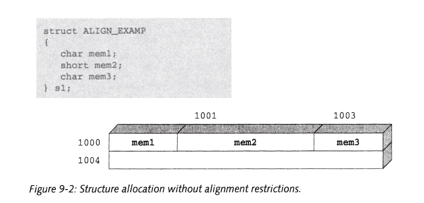
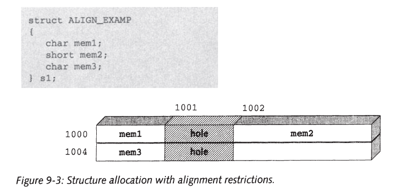
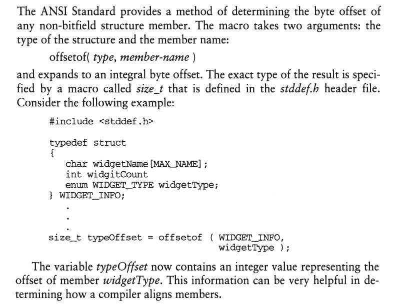
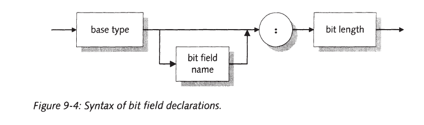
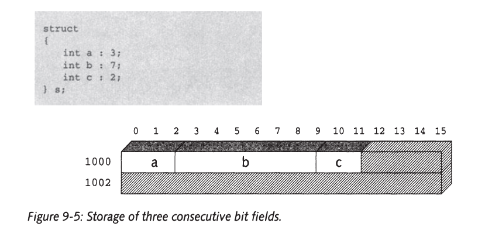
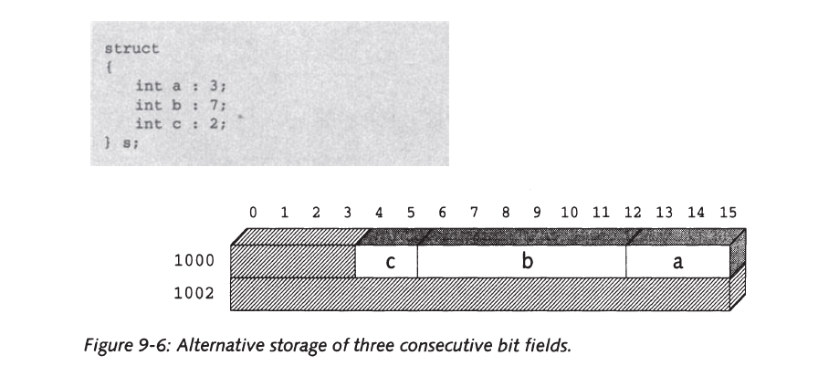
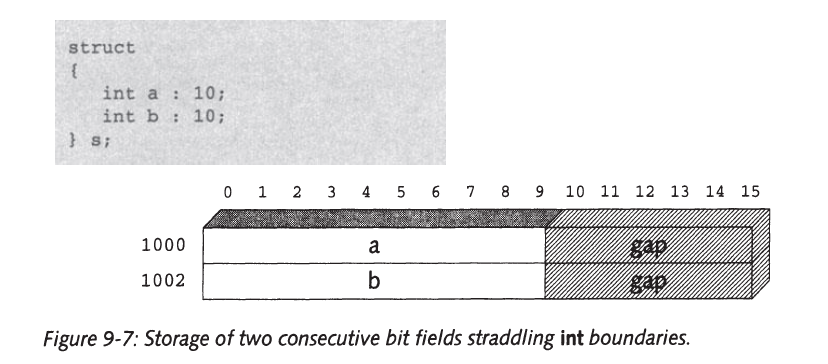

# Structs

Arrays are good for dealing with groups of identically typed variables, but
they are unsatisfactory for managing groups of differently typed data. To
service groups of mixed data, you need to use an aggregate type called a
structure.


* Declare a structure template called vitalstat; 

```c

// Declare Struct Teplate
struct vitalstat {

	char vs_name[19], vs_ssum[11];
	short vs_month, vs_day, vs_year;

};

// Declares an actual variable called vs with the vitalstat form.
struct vitalstat vs;

```

* You can also declare a tag name and variables together. 

```c

struct vitalstat{

	char vs_name[19], vs_ssum[11];
	short vs_month, vs_day, vs_year;

} vs, *pvs, vsa[10];

``` 


* This is useful if you want to declare a single structure type to be used in one place only.

```c

struct{

	char vs_name[19], vs_ssum[11];
	short vs_month, vs_day, vs_year;

} vs;


```

* In this case, the type VITALSTAT represents the entire structure declaration,
including the struct keyword.
	* Note that we use all capital letters for the typedef name to keep it distinct from regular variable names and tag names.

* A tag name or typedef enables you to define the data structure just once even though you may use it over and over again. 
	* Typically, structure definitions are placed in a header file where they can be accessed by multiple source files.

```c
typedef struct {

	char vs_name[19], vs_ssum[11];
	short vs_month, vs_day, vs_year;

} VITALSTAT;

// Declare variable
VITALSTAT vs;

vs = {"George Smith", "0023451526", "3", "5", "1946"};

/* Reference the structe members */

// Method 1

vs.vs_year = 2018;
vs.vs_day = 9;
vs.vs_month = 10;

if(vs.vs_month > 12 || vs.vs_day > 31){
	printf("Illegal Date!\n");
}

// Method 2

VITALSTAT *pvs = &vs;

if(pvs->vs_month > 12 || pvs->vs_day > 31){
	printf("Illegal Date!\n");
}

pvs->vs_month 
//is equal to
(*pvs).vs_month

```

## Arrays Of Structures

```c

VITALSTAT vsa[10];

```


```c

#include "v_stat.h" // contains declaration of VITALSTAT

int agecount(VITALSTAT vsa[], int size, int low_age, int high_age, int current_year){

	int i, age, count = 0;

	for(i = 0; i < size; ++vsa, ++i){
		age = current_year - vsa->vs_year;

		if(age >= low_age  && age <= high_age){
			count++;
		}
	}
	return count;
}


```

* Changing the original parameters can be dangerous sometimes and should be avoided when making complex software.

```c
#include "v_stat.h"

int agecount(VITALSTAT vsa[], int size, int low_age, int current_year){

	int age, count = 0;

	VITALSTAT *p, *p_last = &vsa[size];


	for(p = vsa; p <= p_last; ++p){
		age = current_year - p->vs_year;

		if(age >= low_age && age <= high_age){
			count++;
		}
	}

	return count;
}


```

## Nested Structure

* When one of the fields of a structure is itself a structure, it is called a
nested structure.

```c
#include <stdio.h>

typedef struct{

	char vs_name[19], vs_ssum[11];
	
	struct{
		short vs_day;
		short vs_month;
		short vs_year;
	} vs_birth_date;

} VITALSTAT;

VITALSTAT vs;

printf(vs.vs_birth_date.vs_year);

```

```c
#include <stdio.h>

typedef struct{
	char  day;
	char  month;
	short year;
}DATE;

typedef struct {
	
	char vs_name[19], vs_ssum[11];
	
	DATE vs_birth_date;

} VITALSTAT;

VITALSTAT vsa[1000];

```

## Struct And Union Namespaces

The ANSI Standard requires C compilers to create a separate naming
space within each structure and union, so that two or more structures or
unions can have components with the same name.

```c

struct s1{
	int a,b;
};

struct s2{
	float a,b;
};

```

The following, for example, is legal:

```c

struct x {

	int x;

} x;


```

## Self-referencing Structures

A structure or union may not contain instances of itself, but it may
contain pointers to instances of itself.

```c

struct s{ 
	int a,b;
	float c;
	struct s *pointer_to_s; /* This is legal */
} ;

```

```c

struct node {
	int data1;
	char data2;
	struct node* link; 
}


```

* As this example illustrates, you are permitted to declare pointers to
structures that have not yet been declared. This feature enables you to create
self-referential structures and also to create mutually referential structures
and unions.

```c

struct s1 {
	int a;
	// forward referencing
	struct s2 *b;
};

struct s2 {
	int a;
	struct s1 *b;
}

```

* Note that forward references are not permitted within typedefs.

```c

typedef struct {
	int a;
	FOO *p;

	/* Erro because FOO is not declared yet.*/
} FOO;

```

## Alignment of Structure Members

Some computers require that any data object larger than a char must be assigned an address that is a multiple of a power of two.

* Normally, these alignment restrictions are invisible to the programmer. However, they can create holes, or gaps, in structures.


```c
/* Allignment Example */

struct ALIGN_EXAMP{
	char mem1;
	short mem2;
	char mem3;
}s1;
```
* If the computer has no alignment restrictions, sl would be stored as shown in Figure 9.2.

    

* If the computer requires objects larger than a char to be stored at even
  addresses, 51 would be stored as shown in Figure 9-3.
  
    

Note that you can avoid these holes by rearranging the member declarations:

```c
struct ALIGN_EXAMP{
    char mem1,mem3;
    short mem2;
} s1;    
```

* Because structures can be allocated differently on different machines,
  you should be careful about accessing them in a portable manner. One
  way to avoid portability problems is to make sure that all members are
  **naturally aligned**.
    
    * **Natural alignment** means that an object's address is evenly divisible by its size.
        * For example, all 2-byte objects would have an
        even address and all 4-byte objects would have addresses divisible by four.
        Natural alignment is the strictest alignment requirement that any computer
        imposes, so if all members of a structure are naturally aligned, the
        structure will be portable from one computer to another.
    * You can control the alignment of members by using bit fields, as described in later in this document.
    * You can also promote portability by accessing members by their names
      rather than through unions or offsets from pointers.  

## offsetof Macro



## Bitfields

The smallest data type that C supports is char, which is usually 8 bits long.
But in structures, it is possible to declare a smaller object called a bit field.
Bit fields behave like other integer variables, except that you cannot take
the address of a bit field and you cannot declare an array of bit fields.



* The base type may be **int**, **unsigned int**, or **signed int**.
    * If the bit field is declared as int, the implementation is free to decide whether it is an **unsigned int** or a **signed int**.For portable code, use the signed or unsigned qualifier. (Many compilers allow you to use enums, chars, and shorts as the base type.)

* Bit fields may be named or unnamed.
    * Unnamed fields cannot be accessed and are used only as padding.    
    * As a special case, an unnamed bit field with a width of zero causes the next structure member to be aligned on the next **int** boundary.

* The bit length is an integer constant expression that may not exceed
  the length of an into On machines where ints are 16 bits long, for example,
  the following is illegal:
  
  ```c
    int too_long : 17  
  ```

* The compiler allocates at least a char's worth of memory and possibly
  more. The precise number of bits allocated is implementation dependent,
  but the compiler must allocate at least as many bits as are specified by the
  bit field length, and the length must be an even multiple of chars.
  
* Consecutive
  bit fields are packed into the allocated space until there is no room
  left. Assuming your compiler allocates 16-bits for a bit field, the following
  declarations would cause a, b, and c to be packed into a single 16-bit object
  (see Figure 9-5).
  
      
  
* However, each implementation is free to arrange the bit fields within
  the object in either increasing or decreasing order, so a compiler might
  arrange the bit fields as shown in Figure 9-6.
  
      

* If you are using bit fields to save storage space, you should try to
  arrange the fields to avoid gaps.
  
        
  
As the preceding discussion indicates, the implementation of bit fields
varies somewhat from one compiler to another. Consequently, you should
use bit fields with care-they are inherently nonportable. There are two
situations where the use of bit fields are valid:
1. When efficient use of memory or data storage is a serious concern.
2. When you need to map a structure to a predetermined organization.  

As an example of using bit fields to save space, consider our DATE
structure. Because a day value cannot exceed 31 and a month value cannot
exceed 12, we can rewrite the DATE structure using bit fields as

```c
struct DATE
{
    unsigned int day : 5;
    month: 4;
    year : 11;
} ;

```

Only 20 bits are needed for the three fields. Due to the bit field allocation
rules, however, some compilers would allocate 24 bits whereas others
would allocate 32 bits.