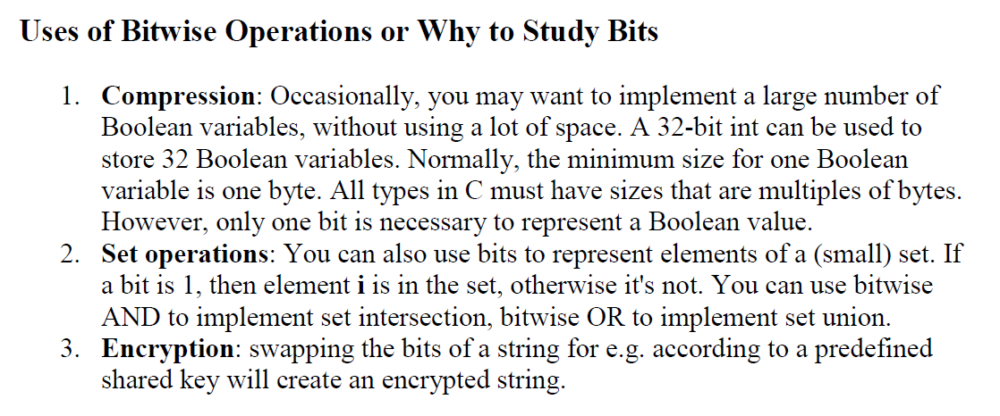
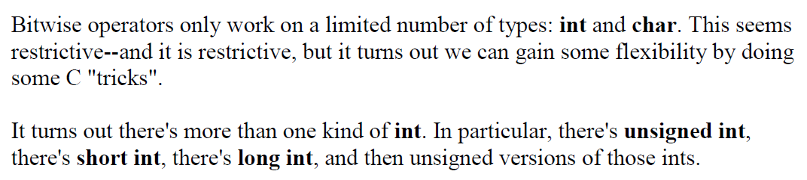
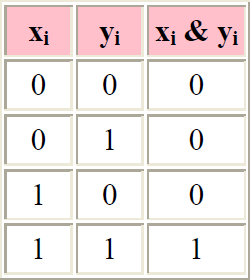
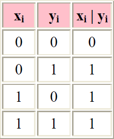
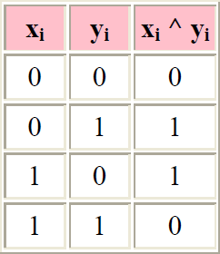
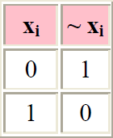
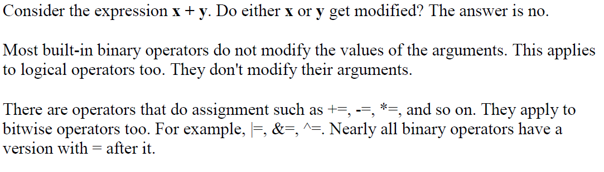

# Bitwise Operators In C

## Generic Bitwise Operations

Bitwise operators fall into two categories: binary bitwise operators and unary bitwise
operators. Binary operators take two arguments, while unary operators only take one.

### Bitwise AND

In C, the & operator is bitwise AND.

### Bitwise OR

The | operator is bitwise OR (it's a single vertical bar).

### Bitwise XOR

The ^ operator is bitwise XOR.

### Bitwise NOT

There's only one unary bitwise operator, and that's bitwise NOT. Bitwise NOT flips
all of the bits.

## Facts About Bitwise Operators

