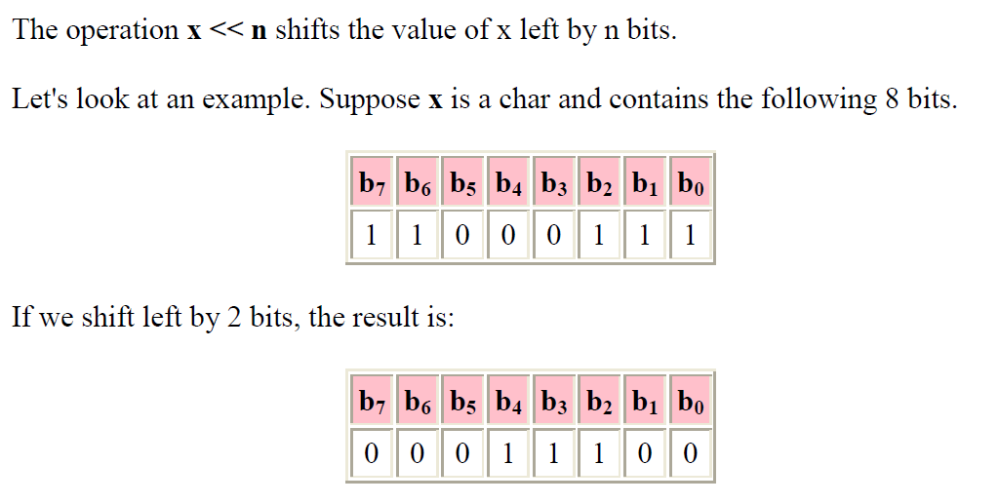

# Bitwise Operators

The bitshift operators take two arguments, and looks like:

x << n

x >> n

where x can be any kind of int variable or char variable, and n can be any kind of int
variable.

## Restrictions

Like bitwise operators, you can only perform bitshift operations on x (the left
argument) on certain types: in particular, any kind of int and any kind of char.
There are sneaky ways to shift bits even if you use other types (say, float). This
involves tricks with casting.

## Operator <<

That means that as you shift left, the bits on the high end (to the left) fall off, and 0 is
shifted in from the right end.

**Left shifting is multiplying by 2K**

If you shift left on an unsigned int by K bits, this is equivalent to multiplying by 2K.

Shifting left on signed values also works, but overflow occurs when the most significant bit changes values (from 0 to 1, or 1 to 0).

## Operator >>

