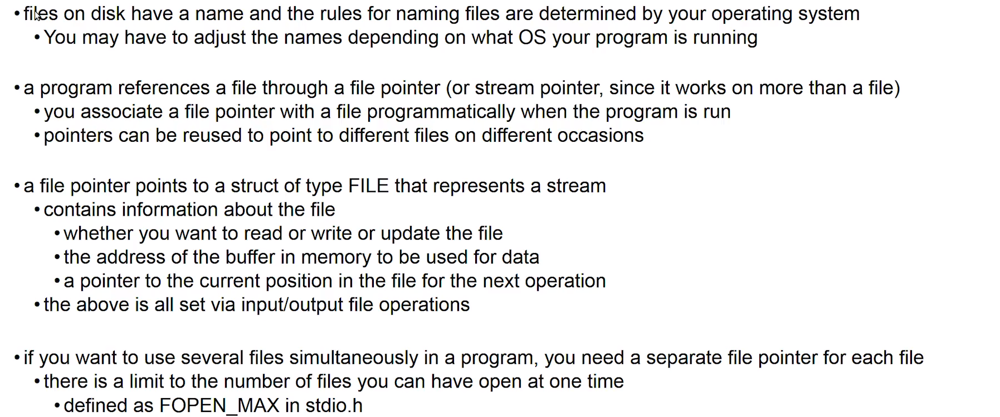
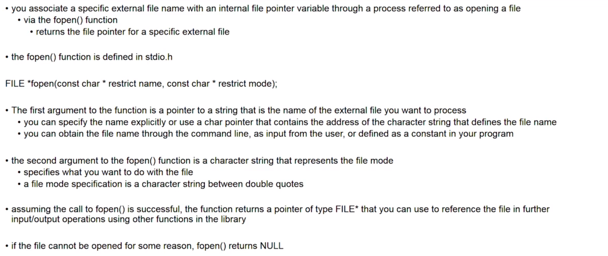
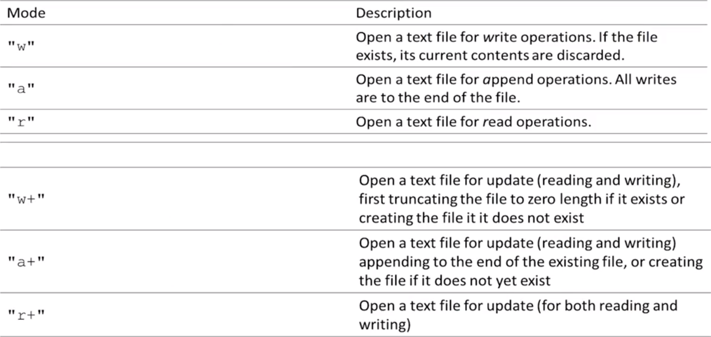
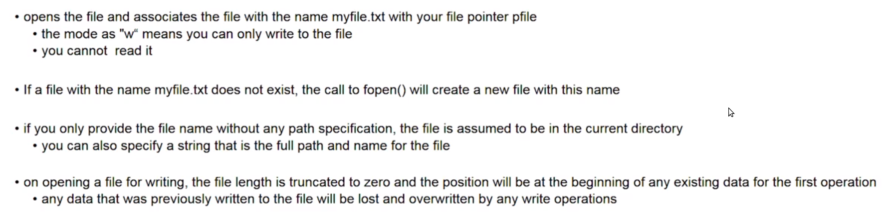
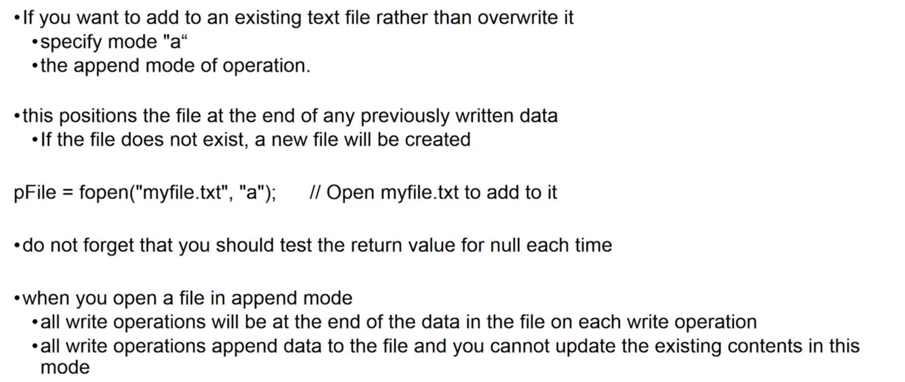
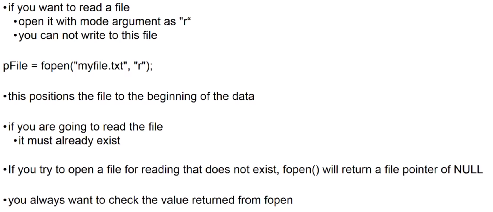
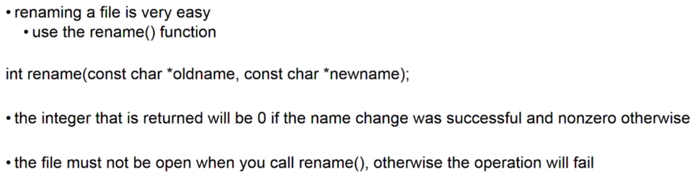
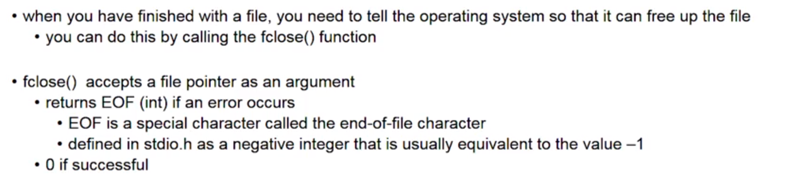
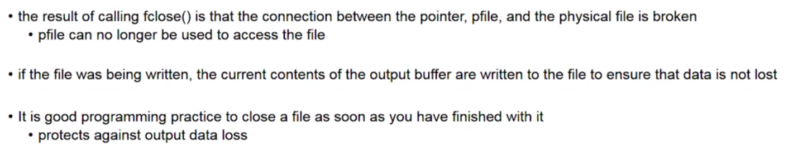
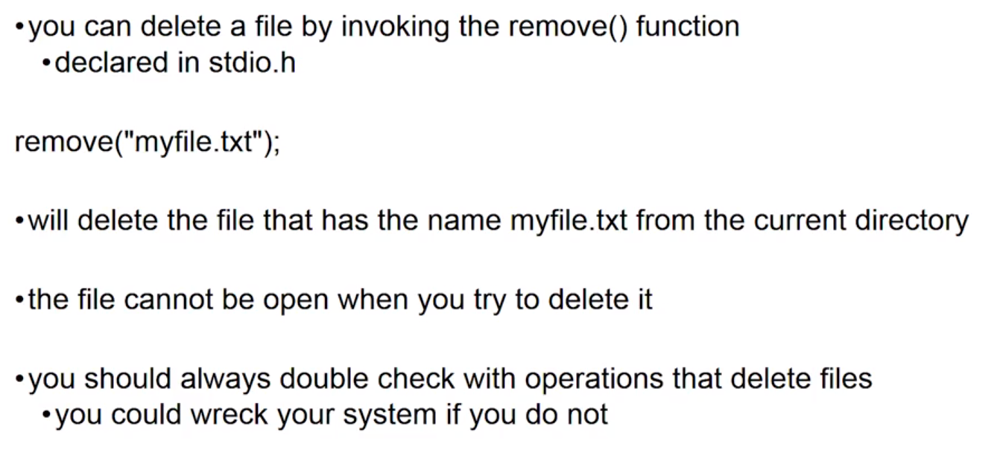

# Accessing Files






## File Modes



### Write mode

```c
FILE *pfile = NULL;
char* filename = "myfile.txt";

pfile = fopen(filename, "w"); 
if(pfile != NULL){
    printf("Failed to open %s\n", filename);
}

```



### Append Mode



### Read Mode



## Renaming a file

Here you don't have to use file pointer because you don't actually want the file open.



```c
#include<stdio.h>

int main(){

if( rename("test.deneme", "test.c") ){

    printf("Failed to rename the file");

}else{

    printf("File named successfully");
}


return 0;
}
```

## Closing a file



```c
fclose(pfile);
pfile = NULL;
```



* You must also close a file before attempting to rename it or remove it.

## Deleting A File

Here you don't have to use file pointer because you don't actually want the file open.

