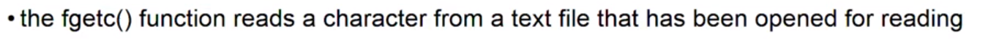
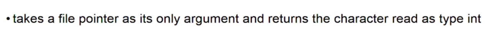
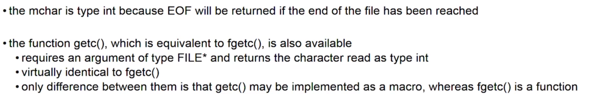
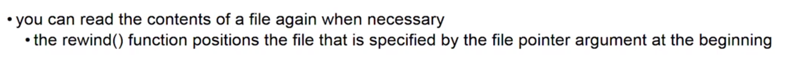

# Reading From A File

* Remember always have to open the file before we perform file operations on it unless the operation is deleting or renaming.)





```c
int mchar = fgetc(pfile);   // Reads a character into mchar with pfile a File pointer.
```




```c
rewind(pfile);
```
