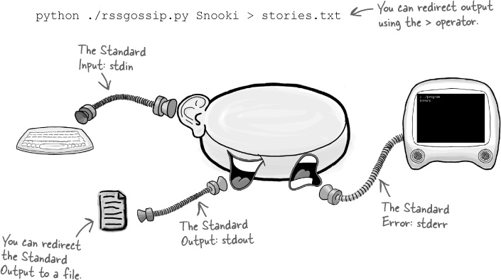
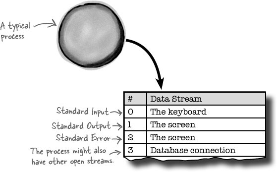
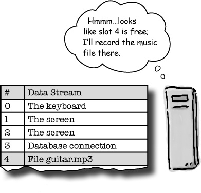
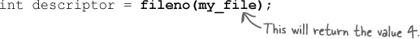

# Interprocess Communication

Creating processes is just half the story.

* What if you want to control the process once it’s running? 
* What if you want to send it data? Or read its output? 

Interprocess communication lets processes work together to get the job done. 

## Redirecting input and output



* The Standard Output is one of the three default data streams. 

* A data stream is exactly what it sounds like: a stream of data that goes into, or comes out of, a process. 

* There are data streams for the Standard Input, Output, and Error, and there are also data streams for other things, like **files** or **network connections**. 

* When you redirect the output of a process, you change where the data is sent. 
    * So, instead of the Standard Output sending data to the screen, you can make it send the data to a file.

Redirection is really useful on the command line, but **is there a way of making a process redirect itself**?

## A look inside a typical process

* Every process will contain the program it’s running, as well as space for stack and heap data. 
    * But it will also need somewhere to record where data streams like the Standard Output are connected. 

* Each data stream is represented by a **file descriptor**, which, under the surface, is just a number. 
    * The process keeps everything straight by storing the file descriptors and their data streams in a descriptor table.

        

    * The descriptor table has **one column for each of the file descriptor numbers**. 
    * Even though these are called file descriptors, they might not be connected to an actual file on the hard disk. 

* Against every file descriptor, the table records the associated data stream. 
    * That **data stream** might be a connection to the **keyboard or screen**, a **file pointer**, or a **connection to the network**.

* The first three slots in the table are always the same. 
    * Slot 0 is the Standard Input
    * Slot 1 is the Standard Output
    * Slot 2 is the Standard Error. 
    
* The other slots in the table are either empty or connected to data streams that the process has opened. 
    * For example, every time your code opens a file for reading or writing, another slot is filled in the descriptor table.

* When the process is created, the Standard Input is connected to the keyboard, and the Standard Output and Error are connected to the screen. 
    * And they will stay connected that way **until something redirects them** somewhere else.

**File descriptors don’t necessarily refer to files.**

## Redirection just replaces data streams

* The Standard Input, Output, and Error are always fixed in the same places in the descriptor table. 
    * But the **data streams they point to can change**.


* That means if you want to redirect the Standard Output, you just need to switch the data stream against descriptor 1 in the table.

* All of the functions, like printf(), that send data to the Standard Output will first look in the descriptor table to see where descriptor 1 is pointing. 
    * They will then write data out to the correct data stream.

## PROCESSES CAN REDIRECT THEMSELVES

* Every time you’ve used redirection so far, it’s been from the command line using the > and < operators. 
    * But **processes can do their own redirection by rewiring the descriptor table**.

---

**So, that’s why it’s 2> ...**

You can redirect the Standard Output and Standard Error on the command line using the > and 2> operators:

```bash
./myprog > output.txt 2> errors.log
```
* Now you can see why the Standard Error is redirected with 2>. 
    * The 2 refers to the number of the Standard Error in the descriptor table. 
    * On most operating systems, you can use 1> as an alternative way of redirecting the Standard Output
    * On Unix-based systems you can even redirect the Standard Error to the same place as the Standard Output like this:
    
        
---

## fileno() tells you the descriptor
Every time you open a file, the operating system registers a new item in the descriptor table. 
```c
FILE *my_file = fopen("guitar.mp3", "r");
```
* The operating system will open the guitar.mp3 file and return a pointer to it, but it will also skim through the descriptor table until it finds an empty slot and register the new file there.
    
    

* But once you’ve got a file pointer, how do you find it in the descriptor table?
    * The answer is **by calling the fileno() function**.
    
        

* fileno() is one of the few system functions that doesn’t return –1 if it fails. 
    * As long as you pass fileno() the pointer to an open file, it should always return the descriptor number.
