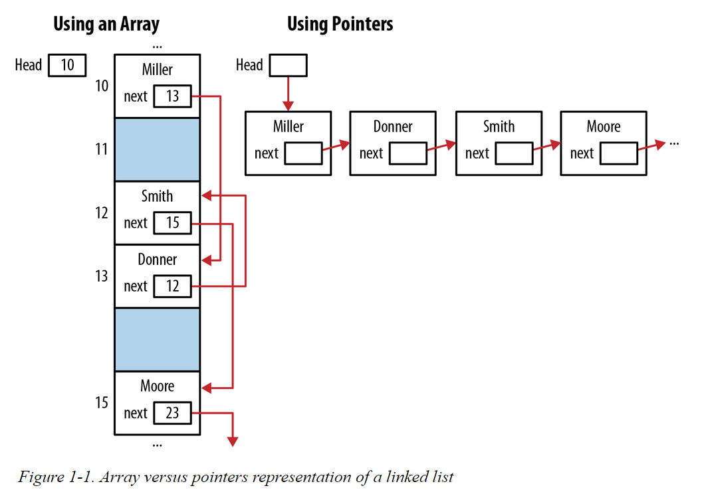

# WHY YOU SHOULD BECOME PROFICIENT WITH POINTERS

Pointers have several uses, including:

* Creating fast and efficient code

* Providing a convenient means for addressing many types of problems

* Supporting dynamic memory allocation

* Making expressions compact and succinct

* Providing the ability to pass data structures by pointer without incurring a large overhead

* Protecting data passed as a parameter to a function

---

* Faster and more efficient code can be written because pointers are closer to the hardware. 
    * The compiler can more easily translate the operation into machine code. There is not as much overhead associated with pointers as might be present with other operators.

* Many data structures are more easily implemented using pointers. For example, a linked list could be supported using either arrays or pointers. However, pointers are easier to use and map directly to a next or previous link. An array implementation requires array indexes that are not as intuitive or as flexible as pointers.

The pointer representation is not only clearer but also more flexible. The size of an array typically needs to be known when it is created. This will impose a restriction on the number of elements it can hold. The pointer representation does not suffer from this limitation as a new node can be dynamically allocated as needed.

Figure 1-1 illustrates how this can be visualized using arrays and pointers for a linked list of employees.

---

* Dynamic memory allocation is effected in C through the use of pointers. The malloc and free functions are used to allocate and release dynamic memory, respectively.
    
    * Dynamic memory allocation enables variable-sized arrays and data structures, such as linked lists and queues. 
    
    * However, in the new C standard, C11, variable size arrays are supported.

---
    
Pointers represent a powerful tool to create and enhance applications. On the downside, many problems can occur when using pointers, such as:

* Accessing arrays and other data structures beyond their bounds

* Referencing automatic variables after they have gone out of existence

* Referencing heap allocated memory after it has been released

* Dereferencing a pointer before memory has been allocated to it