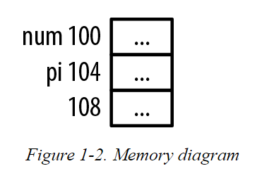
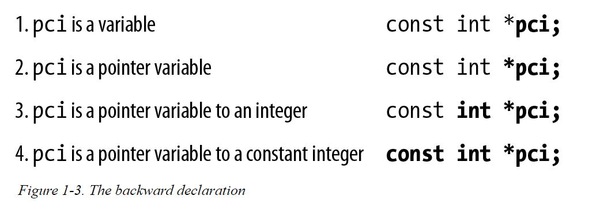

# Declaring Pointers

In the following example, an integer and a pointer to an integer are declared:

```c
   int num;
   int *pi;
```

* The use of white spaces around the asterisk is irrelevant. The following declarations are all equivalent:
    * The use of white space is a matter of user preference.
```c
   int* pi;
   int * pi;
   int *pi;
   int*pi;
```
* The asterisk declares the variable as a pointer. 
    * It is an overloaded symbol as it is also used for multiplication and dereferencing a pointer.

* Figure 1-2 illustrates how memory would typically be allocated for the above declaration. 
* The name next to the address is the variable assigned to this location. 
    * The address 100 is used here for illustrative purposes. 
    * The actual address of a pointer, or any variable for that matter, is not normally known, nor is its value of interest in most applications. 
    * The three dots represent uninitialized memory.
   


Pointers to uninitialized memory can be a problem. 

* If such a pointer is dereferenced, the pointer’s content probably does not represent a valid address, and if it does, it may not contain valid data. 

* An invalid address is one that the program is not authorized to access. This will result in the program terminating on most platforms, which is significant and can lead to a number of problems.

* The variables num and pi are located at addresses 100 and 104, respectively. 
    * Both are assumed to occupy four bytes. 
    * Both of these sizes will differ, depending on the system configuration as addressed in the section Pointer Size and Types. 
    * Unless otherwise noted, we will use four-byte integers for all of our examples.
---

#### NOTE

In this series, we will use an address such as 100 to explain how pointers work.
This will simplify the examples. When you execute the examples you will get different addresses, and these addresses can even change between repeated executions of the program.

---

There are several points to remember:

* The content of pi should eventually be assigned the address of an integer variable.

* These variables have not been initialized and thus contain garbage.

* There is nothing inherent to a pointer’s implementation that suggests what type of data it is referencing or whether its contents are valid.

* However, the pointer type has been specified and the compiler will frequently complain when the pointer is not used correctly.

#### NOTE
    
By garbage, we mean the memory allocation could contain any value. When memory is allocated it is not cleared. The previous contents could be anything. If the previous contents held a floating point number, interpreting it as an integer would likely not be useful. Even if it contained an integer, it would not likely be the right integer. Thus, its contents are said to hold garbage.

---

## HOW TO READ A DECLARATION

Now is a good time to suggest a way to read pointer declarations, which can make them easier to understand. 

The trick is to read them backward. While we haven’t discussed pointers to constants yet, let’s examine the following declaration:

```c
   const int *pci;
```

Reading the declaration backward allows us to progressively understand the declaration (Figure 1-3).



* Many programmers find that reading the declaration backward is less complex.
