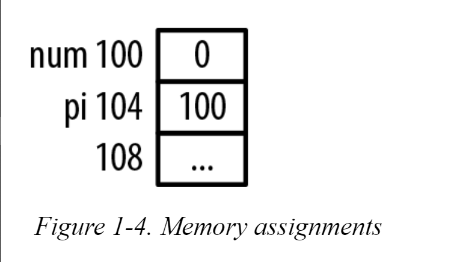

# Address Of Operator

The address of operator, &, will return its operand’s address. 

```c
    int num
    int *pi
```

We can initialize the pi pointer with the address of num using this operator as follows:

```c
    num = 0;
    pi = &num;
```



---

We could have initialized pi to point to the address of num when the variables were declared as illustrated below:

```c
    int num;
    int *pi = &num;
```

---

Using these declarations, the following statement will result in a syntax error on most compilers:

```
   int num;
   int *pi;
   
   num = 0; // num is an int
   pi = num; // pi is an int* but we're trying to assgin each other.
   
   // error: invalid conversion from 'int' to 'int*'
```

The variable pi is of type pointer to an integer and num is of type integer. The error message is saying we cannot convert an integer to a pointer to the data type integer.

#### Note

* Assignment of integers to a pointer will generally cause a warning or error.

---

Pointers and integers are not the same. 

* They may both be stored using the same number of bytes on most machines, but they are not the same. 

* However, it is possible to cast an integer to a pointer to an integer:

```c
 pi = (int *)num;
```

* This will not generate a syntax error. 

* When executed, though, the program may terminate abnormally when the program attempts to dereference the value at address zero. 

* An address of zero is not always valid for use in a program on most operating systems. 

---

#### NOTE

It is a good practice to initialize a pointer as soon as possible, as illustrated below:

```c
    int num;
    int *pi;
    pi = &num;
```

---

