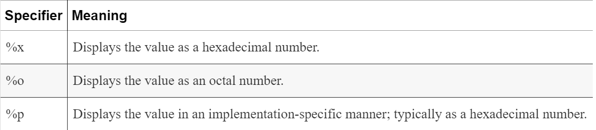

# Displaying Pointer Values

The variable’s address can be determined by printing it out as follows:

```c
   int num = 0;
   int *pi = &num;

   printf("Address of num: %d  Value: %d ",&num, num);
   printf("Address of pi: %d  Value: %d ",&pi, pi);

```

When executed, you may get output as follows. We used real addresses in this example. Your addresses will probably be different:


Address of num: 4520836  Value: 0

Address of pi: 4520824  Value: 4520836

The printf function has a couple of other field specifiers useful when displaying pointer values, as summarized in Table.



```c
   printf("Address of pi: %d  Value: %d\n",&pi, pi);
   printf("Address of pi: %x  Value: %x\n",&pi, pi);
   printf("Address of pi: %o  Value: %o\n",&pi, pi);
   printf("Address of pi: %p  Value: %p\n",&pi, pi);
```

* The %p specifier differs from %x as it typically displays the hexadecimal number in uppercase. 
    * We will use the %p specifier for addresses unless otherwise indicated.

* Displaying pointer values consistently on different platforms can be challenging. 
    * One approach is to cast the pointer as a pointer to void and then display it using the %p format specifier as follows:
    ```c
        printf("Value of pi: %p\n", (void*)pi);    
    ```
* To keep our examples simple, we will use the %p specifier and not cast the address to a pointer to void.    
    
## Virtual memory and pointers

The pointer addresses displayed on a virtual operating system are not likely to be the real physical memory addresses. 

 A **virtual operating system** allows a program to be split across the machine’s physical address space.
 

 * An application is split into pages/frames. 
    * These pages represent areas of main memory. The pages of the application are allocated to different, potentially noncontiguous areas of memory and may not all be in memory at the same time. 
    * If the operating system needs memory currently held by a page, the memory may be swapped out to secondary storage and then reloaded at a later time, frequently at a different memory location. 

These capabilities provide a virtual operating system with considerable flexibility in how it manages memory.

Each program assumes it has access to the machine’s entire physical memory space. 
* In reality, it does not. 
    
    * The address used by a program is a virtual address. 
    
    * The operating system maps the virtual address to a real physical memory address when needed.

* This means code and data in a page may be in different physical locations as the program executes. 
    
    * The application’s virtual addresses do not change; they are the addresses we see when we examine the contents of a pointer. 
    
    * The virtual addresses are transparently mapped to real addresses by the operating system.

The operating system handles all of this, and it is not something that the programmer has control over or needs to worry about. 

Understanding these issues explains the addresses returned by a program running in a virtual operating system.