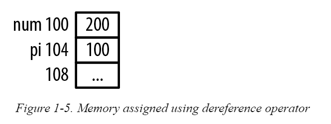

# DEREFERENCING A POINTER USING THE INDIRECTION OPERATOR

The indirection operator, *, returns the value pointed to by a pointer variable.

This is frequently referred to as **dereferencing** a pointer.

```c
    int num = 5;
    int *pi = &num;
    printf("%d\n",*pi);   // Displays 5
    // we use %d since the return value of *pi is an integer
```

```c

    int num = 5;
    int *pi = &num;
    printf("%d\n",*pi);   // Displays 5

    *pi = 200;
    printf("%d\n",num);  // Displays 200
    printf("%d\n",*pi);  // Displays 200
```



