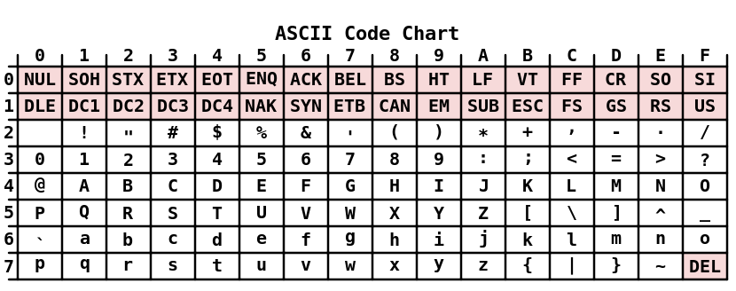

# The Concept Of NULL

The concept of null is interesting and sometimes misunderstood. Confusion can occur because we often deal with several similar, yet distinct concepts, including:

* The null concept

* The null pointer constant

* The NULL macro

* The ASCII NUL

* A null string

* The null statement

---

When NULL is assigned to a pointer, it means the pointer does not point to anything. 

* The null concept refers to the idea that a pointer can hold a special value that is not equal to another pointer. 

* It does not point to any area of memory. 

* There can be a null pointer type for each pointer type, such as a pointer to a character or a pointer to an integer, although this is uncommon.


* Two null pointers will always be equal to each other. 

```c
#include<stdio.h>

int main(){


    char* charPtr1 = NULL;
    char* charPtr2 = NULL;
    int* intPtr1 = NULL;
    int* intPtr2 = NULL;

    if(charPtr1 == charPtr2){
        printf("charPtr1 is equal to charPtr2\n");  // true
    }

    if(intPtr1 == intPtr2){
        printf("intPtr1 is equal to intPtr2\n");    // true
    }
    
    
    // warning: comparison of distinct pointer types lacks a cast
    if(charPtr1 == intPtr1){                        
        printf("charPtr1 is equal to intPtr2\n");   // true
    }

    if( (void*)charPtr1 == (void*)intPtr1  ){   
        printf("casted versions of the charPtr1 and "
                "intPtr1 are equal to each other.\n"); // true
    }

}
```

---

The null concept is an abstraction supported by the null pointer constant.

* This constant may or may not be a constant zero. 
    * A C programmer need not be concerned with their actual internal representation.

The NULL macro is a constant integer zero cast to a pointer to void. In many libraries, it is defined as follows:

```c
#define NULL    ((void *)0)
```

This is what we typically think of as a null pointer. Its definition frequently can be found within several different header files, including stddef.h, stdlib.h, and stdio.h.

---

If a nonzero bit pattern is used by the compiler to represent null, then it is the compiler’s responsibility to ensure all uses of NULL or 0 in a pointer context are treated as null pointers. 

The actual internal representation of null is implementation-defined. The use of NULL and 0 are language-level symbols that represent a null pointer.

--- 





The ASCII NUL is defined as a byte containing all zeros. 

* However, this is not the same as a null pointer. 

* A string in C is represented as a sequence of characters terminated by a zero value. 

* The null string is an empty string and does not contain any characters. 

---

* Finally, the [null statement](https://msdn.microsoft.com/en-us/library/1zea45ac.aspx) consists of a statement with a single semicolon.

> The "null statement" is an expression statement with the expression missing. 

> It is useful when the syntax of the language calls for a statement but no expression evaluation. 

> It consists of a semicolon.
  
> Null statements are commonly used as placeholders in iteration statements or as statements on which to place labels at the end of compound statements or functions.

* For example, when you want to find the index of first occurrence of a certain character in a string


```c
int a[50] = "lord of the rings";
int i;

for(i = 0; a[i] != 't'; i++)
    ;//null statement
//as no operation is required
```

```c
char *myStrCpy( char *Dest, const char *Source )  
{  
    char *DestStart = Dest;  
  
    // Assign value pointed to by Source to  
    // Dest until the end-of-string 0 is  
    // encountered.  
    while( *Dest++ = *Source++ )  
        ;   // Null statement.  
  
    return DestStart;  
}  
  
```

---

#### NOTE

A null pointer and an uninitialized pointer are different. An uninitialized pointer can contain any value, whereas a pointer containing NULL does not reference any location in memory.

---

* Interestingly, we can assign a zero to a pointer, but we cannot assign any other integer value.

```c
   pi = 0;
   pi = NULL;
   pi = 100;   // Syntax error
   pi = num;   // Syntax error
```

---

* A pointer can be used as the sole operand of a logical expression. For example, we can test to see whether the pointer is set to NULL using the following sequence:

```c
if(pi) {
      // Not NULL
   } else {
      // Is NULL
   }
   
```

---

#### NOTE

Either of the two following expressions are valid but are redundant. It may be clearer, but explicit comparison to NULL is not necessary.

```c
if(pi == NULL){
    ...
}

if(pi != NULL){
    ...
}
```

---

* A null pointer should never be dereferenced because it does not contain a valid address. When executed it will result in the program terminating.

---

## To NULL or not to NULL

Which is better form: using NULL or using 0 when working with pointers?

* Either is perfectly acceptable 
    * The choice is one of preference.

* Some developers prefer to use NULL because it is a reminder that we are working with pointers. Others feel this is unnecessary because the zero is simply hidden.

* However, **NULL should not be used in contexts other than pointers**.
    * It might work some of the time, but it is not intended to be used this way.

* It can definitely be a problem when used in place of the ASCII NUL character.

* This character is not defined in any standard C header file. It is equivalent to the character literal, '\0', which evaluates to the decimal value zero.

* The meaning of zero changes depending on its context. 
    * It might mean the integer zero in some contexts, and it might mean a null pointer in a different context. 
    
```c
   int num;
   int *pi = 0;   // Zero refers to the null pointer,NULL
   pi = &num;
   *pi = 0;        // Zero refers to the integer zero
```

---

* We are accustomed to overloaded operators, such as 
    * the asterisk used to declare a pointer,
    * to dereference a pointer, 
    * or to multiply.

* The zero is also overloaded. 
    * We may find this discomforting because we are not used to overloading operands.
