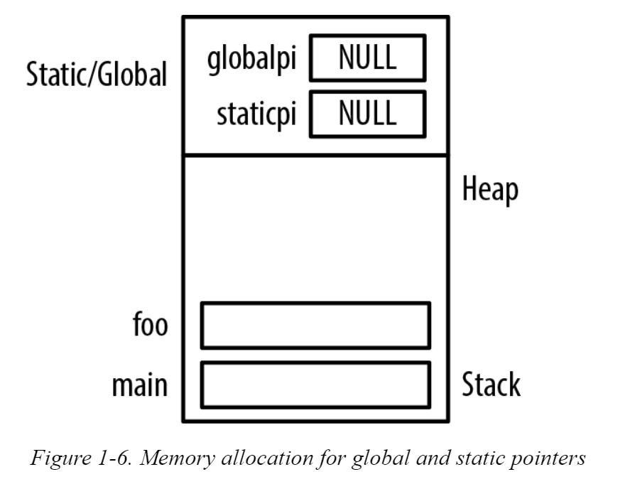

# Global and static pointers

If a pointer is declared as global or static, it is initialized to NULL when the program starts. 

```c
int *globalpi;

void foo() {
   static int *staticpi;
   ...
}

int main() {
   ...
}
```
 * Stack frames are pushed onto the stack, and the heap is used for dynamic memory allocation. 
 
 * The region above the heap is used for static/global variables. 
    * This is a conceptual diagram only. 
    * Static and global variables are frequently placed in a **data segment separate from the data segment used by the stack and heap**.

