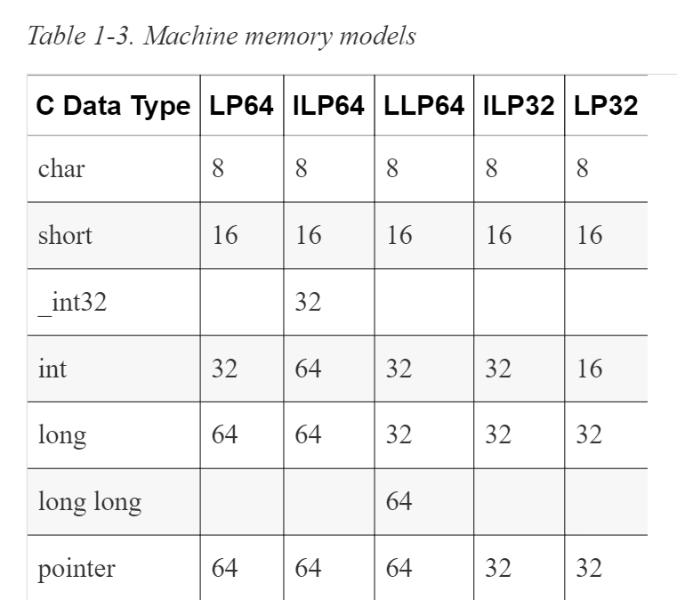

# Pointer Size and Types

Pointer size is an issue when we become concerned about application **compatibility** and **portability**.

* On most modern platforms, the size of a pointer to data is normally the same regardless of the pointer type. 
    * A pointer to a char has the same size as a pointer to a structure. 
    * While the C standard does not dictate that size be the same for all data types, this is usually the case. 

* However, the size of a pointer to a function may be different from the size of a pointer to data.

* The size of a pointer depends on the machine in use and the compiler. 

* For example, on modern versions of Windows the pointer is 32 or 64 bits in length. For DOS and Windows 3.1 operating systems, pointers were 16 or 32 bits in length.

## MEMORY MODELS

The introduction of 64-bit machines has made more apparent the differences in the size of memory allocated for data types. 

* With different machines and compilers come different options for allocating space to C primitive data types.



* The model depends on the operating system and compiler. 

* More than one model may be supported on the same operating system; this is often controlled through compiler options.


## PREDEFINED POINTER-RELATED TYPES

Four predefined types are frequently used when working with pointers.

* **size_t**
    * Created to provide a safe type for sizes

* **ptrdiff_t**
    * Created to handle pointer arithmetic

* **intptr_t** and **uintprt_t**
    * Used for storing pointer addresses

### Understanding size_t

The type size_t represents the maximum size any object can be in C.

 * It is an unsigned integer since negative numbers do not make sense in this context. 
 
 * Its purpose is to provide a portable means of declaring a size consistent with the addressable area of memory available on a system. 
 
 * The size_t type is used as the return type for the sizeof operator and as the argument to many functions, including malloc and strlen, among others.
 
 ---
 
 #### Note:
 
 It is good practice to use size_t when declaring variables for sizes such as the number of characters and array indexes. 
 
 It should be used for loop counters, indexing into arrays, and sometimes for pointer arithmetic.
 
 ---
 
 The declaration of size_t is implementation-specific. 
 
 It is found in one or more standard headers, such as stdio.h and stdlib.h, and it is typically defined as follows:
 
 ```c
 #ifndef __SIZE_T
 #define __SIZE_T
 typedef unsigned int size_t;
 #endif
 ```
 
 The define directives ensure it is only defined once. 
 
 * The actual size will depend on the implementation. 
    * Typically, on a 32-bit system, it will be 32 bits in length, while on a 64-bit system it will be 64 bits in length. 
    * Normally, the maximum possible value for size_t is **SIZE_MAX**.
    
---

#### Warning

Usually size_t can be used to store a pointer, but it is not a good idea to assume size_t is the same size as a pointer. 

As we will see in Using the sizeof operator with pointers, intptr_t is a better choice.

---

* Be careful when printing values defined as size_t. 
    * These are unsigned values, and if you choose the wrong format specifier, you’ll get unreliable results. 
    * The recommended format specifier is %zu. 
    * However, this is not always available. As an alternative, consider using %u or %lu.     

Since a variable of type size_t is intended for use with positive integers, using a negative value can present problems. When we assign it a negative number and use the %d and then the %zu format specifiers, we get the following output:
       
```c
   size_t sizet = -5;
   printf("%d\n",sizet);  // -5
   printf("%zu\n",sizet); // 4294967291
```    
 * The %d field interprets size_t as a signed integer. 
    * It displays a –5 because it holds a –5. 
 * The %zu field formats size_t as an unsigned integer. 
    * When –5 is interpreted as a signed integer, its high-order bit is set to one, indicating that the integer is negative. 
 * When interpreted as an unsigned number, the high-order bit is interpreted as a large power of 2. 
    * This is why we saw the large integer when we used the %zu field specifier.
 
 ---
 
 A positive number will be displayed properly as shown below:
 
 ```c
    sizet = 5;
    printf("%d\n",sizet);    // Displays 5
    printf("%zu\n",sizet);   // Displays 5
 ```   
 
 Since size_t is unsigned, always assign a positive number to a variable of that type.
 
 ---
 
 ### Using the sizeof operator with pointers
 
 The sizeof operator can be used to determine the size of a pointer. 
 
 ```c
 printf("Size of *char: %d\n",sizeof(char*));
 // Size of *char: 4
 ```
 
 > Always use the sizeof operator when the size of a pointer is needed.
 
 * The size of a function pointer can vary. 
 
 * Usually, it is consistent for a given operating system and compiler combination. 
 
 * Many compilers support the creation of a 32-bit or 64-bit application. 
    * It is possible that the same program, compiled with different options, will use different pointer sizes.

### Using intptr_t and uintptr_t

