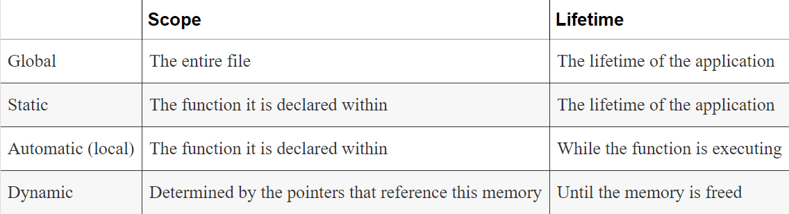

# Pointers

Pointers have long been a stumbling block in learning C. The basic concept of a pointer is simple: it is a variable that stores the address of a memory location. The concept, however, quickly becomes complicated when we start applying pointer operators and try to discern their often cryptic notations. But this does not have to be the case. If we start simple and establish a firm foundation, then the advanced uses of pointers are not hard to follow and apply.

## Pointers and Memory

### Static/Global

Statically declared variables are allocated to this type of memory. Global variables also use this region of memory. They are allocated when the program starts and remain in existence until the program terminates. While all functions have access to global variables, the scope of static variables is restricted to their defining function.

### Automatic

These variables are declared within a function and are created when a function is called. Their scope is restricted to the function, and their lifetime is limited to the time the function is executing.

### Dynamic

Memory is allocated from the heap and can be released as necessary. A pointer references the allocated memory. The scope is limited to the pointer or pointers that reference the memory. It exists until it is released. 

 Most pointers are used to manipulate data in memory. Understanding how memory is partitioned and organized will clarify how pointers manipulate memory.
 
*  A pointer variable contains the address in memory of another variable, object, or function. 
    
    * An object is considered to be memory allocated using one of the memory allocation functions, such as the malloc function.
 
 * A pointer is normally declared to be of a specific type depending on what it points to, such as a pointer to a char. The object may be any C data type such as integer, character, string, or structure. However, nothing inherent in a pointer indicates what type of data the pointer is referencing. A pointer only contains an address.
 
 