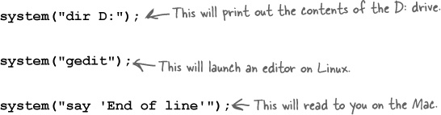
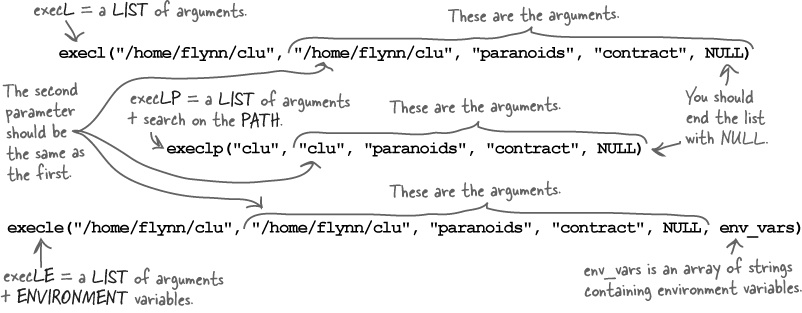
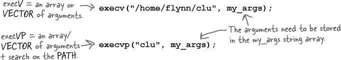
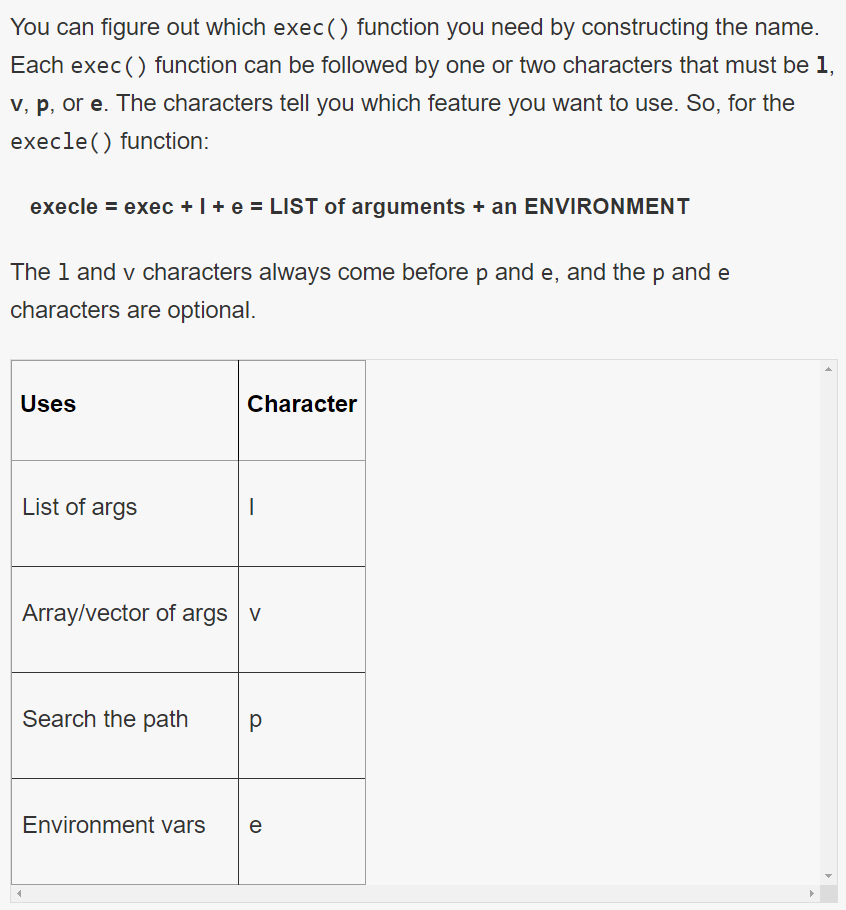

# Processes And System Calls

* What if you want to use other programs from inside your own code? 
    * You’ll learn how to use system services to create and control processes. 
    * That will give your programs access to email, the Web, and any other tool you’ve got installed.

## System calls

* C programs rely on the operating system for pretty much everything.

* They make system calls if they want to talk to the hardware.

* System calls are just functions that live inside the operating system’s kernel. 
    * Most of the code in the C Standard Library depends on them.

* system() takes a single string parameter and executes it as if you had typed it on the command line.

 

* The system() function is an easy way of running other programs from your code
    * Particularly if you’re creating a quick prototype and you’d sooner call external programs rather than write lots and lots of C code.

### Q-A

* Does the system() function get compiled into my program?
    * No. The system() function—like all system calls—doesn’t live in your program. It lives in the main operating system.

* So, when I make a system call, I’m making a call to some external piece of code, like a library?
    * Kind of. But the details depend on the operating system. 
        * On some operating systems, the code for a system call lives inside the kernel of the operating system.
        * On other operating systems, it might simply be stored in some dynamic library.

### Problems of system call
* By injecting some command-line code into the text, you can make the program run whatever code you like
    * It could have deleted files or launched a virus.
    
*  What if the comments contain apostrophes?
    * That might break the quotes in the command.
    
* What if the PATH variable causes the system() function to call the wrong program?

* What if the program we’re calling needs to have a specific set of environment variables set up first?

> The system() function is easy to use, but most of the time, you’re going to need something more structured—some way of calling a specific program, with a set of command-line arguments and maybe even some environment variables.

---

### What’s the kernel?

* On most machines, system calls are functions that live inside the kernel of the operating system.
 
* But what is the kernel? 
    * You never actually see the kernel on the screen, but it’s always there, controlling your computer. 
    * The kernel is the most important program on your computer, and it’s in charge of three things:

#### Processes

* No program can run on the system without the kernel loading it into memory.
 
* The kernel creates processes and makes sure they get the resources they need.
 
* The kernel also watches for processes that become too greedy or crash.

#### Memory 

* Your machine has a limited supply of memory, so the kernel has to carefully ration the amount of memory each process can take.
 
* The kernel can increase the virtual memory size by quietly loading and unloading sections of memory to disk.

#### Hardware
* The kernel uses device drivers to talk to the equipment that’s plugged into the computer.
 
* Your program can use the keyboard and the screen and the graphics processor without knowing too much about them, because the kernel talks to them on your behalf.

---

## The exec() functions give you more control

* When you call the system() function, the operating system has to interpret the command string and decide which programs to run and how to run them. 

* And that’s where the problem is: the operating system needs to interpret the string, and you’ve already seen how easy it is to get that wrong by injecting somethings.
 
 * So, the solution is to remove the ambiguity and tell the operating system precisely which program you want to run. That’s what the exec() functions are for.
 
### EXEC() FUNCTIONS REPLACE THE CURRENT PROCESS 

* A process is just a program running in memory.

* `-ps ef`  on most other machines, you’ll see the processes running on your system.
 
* The operating system tracks each process with a number called the process identifier ( **PID**).

* The exec() functions replace the current process by running some other program. 
    * You can say which command-line arguments or environment variables to use, and when the new program starts it will have exactly the same PID as the old one. 
    * It’s like a relay race, where your program hands over its process to the new program.
    * A process is a program running in memory.
    
      
    
### There are many exec() functions
* Over time, programmers have created several different versions of exec(). 
* Each version has a slightly different name and its own set of parameters. 
* Even though there are lots of versions, there are really just two groups of exec() functions: 
    * The list functions 
    * THe array functions.

> **The exec() functions are in unistd.h**.

#### The List Functions
* execl()
* execlp()
* execle()

* The list functions accept command-line arguments as a list of parameters, like this:
    * **The program**
        * This might be the full pathname of the program— execl()/ execle()—or just a command name to search for— execlp()—but the first parameter tells the exec() function what program it will run.
    * **The command-line arguments**.
        * You need to list one by one the command-line arguments you want to use. Remember: **the first command-line argument is always the name of the program. **That means the first two parameters passed to a list version of exec() should always be the same string.
    * **NULL**
        * That’s right. After the last command-line argument, you need a NULL. This tells the function that there are no more arguments.
    * **Environment variables (maybe)**.
        * If you call an exec() function whose name ends with ...e(), you can also pass an array of environment variables. This is just an array of strings like "POWER=4", "SPEED=17", "PORT=OPEN", .... 

    

#### The Array Functions
* execv()
* execvp()
* execve()

* If you already have your command-line arguments stored in an array, you might find these two versions easier to use:
    
    

* The only difference between these two functions is that  execvp will      search for the program using the PATH      variable    

### HOW TO REMEMBER THE EXEC() FUNCTIONS

 

   

#### Passing environment variables

