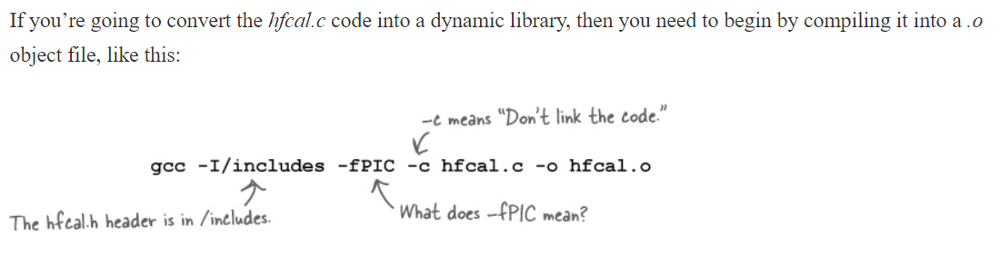

# Dynamic Libraries

## Why Use Dynamic Libraries
* First we've written v1 of Head First Gym libraries.(see from example codes)

* Turns out, there’s a problem. The Head First Gyms are expanding everywhere, in different countries that use different languages and different measures. For example, in England, the machines need to report information in kilograms and kilometers:

* The gyms have lots of different types of equipment. If they have 20 different types of machines, and they have gyms in 50 countries, that means there will be 1,000 different versions of the software. That’s a lot of different versions.

* And then there are other problems too:
  * If an engineer upgrades the sensors used on a machine, she might need to upgrade the code that talks to them.
  * If the displays ever change, the engineers might need to change the code that generates the output.
  * Plus many, many other variations.
* If you think about it, you get the same kinds of problems when you write any software. Different machines might require different device driver code, or they might need to talk to different databases or different graphical user interfaces. You probably won’t be able to build a version of your code that will work on every machine, so what should you do?

### Programs are made out of lots of pieces...

**...BUT ONCE THEY’RE LINKED, YOU CAN’T CHANGE THEM**

* The problem is that if you build programs like this(see from v1 example code), they are static. Once you’ve created a single executable file from those separate pieces of object code, you really have no way of changing any of the ingredients without rebuilding the whole program.

### Dynamic linking happens at runtime

* The reason you can’t change the different pieces of object code in an executable file is because, well, they are all contained in a single file. They were statically linked together when the program was compiled.

    

* But if your program wasn’t just a single file—if your program was made up of lots of separate files that only joined together when the program was run—you would avoid the problem.

    
    
* The trick, then, is to find a way of storing pieces of object code in separate files and then dynamically linking them together only when the program runs.

     

### Can you link .a at runtime?
* So you need to have separate files containing separate pieces of object code. But you’ve already got separate files containing object code: the .o object files and the .a archive files. Does that mean you just need to tell the computer not to link the .o files until you run the program?
   * **Sadly, it’s not that easy.** Simple object files and archives don’t have quite enough information in them to be linked together at runtime. There are other things our dynamic library files will need, like the names of the other files they need to link to. 

## Dynamic Libraries

* Dynamic libraries are similar to those .o object files, but they’re not quite the same. 
    * Like an archive file, a dynamic library can be built from several .o object files
    * But unlike an archive, the object files are properly linked together in a dynamic library to form a single piece of object code.
    
    

### How to Create Dynamic Libraries

#### First, create an object file

* You’re creating the hfcal.o exactly the same as before except you’re adding an extra flag: -fPIC. 
    * This tells gcc that you want to create position-independent code. 
    * Some operating systems and processors need to build libraries from position-independent code so that they can decide at runtime where they want to load it into memory.
    * Now, the truth is that on most systems you don’t need to specify this option. 
        
**Position-independent code can be moved around in memory.**

---

##### What is position-independent code?
* Position-independent code is code that doesn’t mind where the computer loads it into memory. 
    * Imagine you had a dynamic library that expected to find the value of some piece of global data 500 bytes away from where the library is loaded. 
    * Bad things would happen if the operating system decided to load the library somewhere else in memory. 
    * If the compiler is told to create position-independent code, it will avoid problems like this.
    
* Some operating systems, like Windows, use a technique called memory mapping when loading dynamic libraries, which means all code is effectively position-independent. 
    * If you compile your code on Windows, you might find that gcc will give you a warning that the -fPIC option is not needed. 
        * You can either remove the -fPIC flag, or ignore the warning. 
        * Either way, your code will be fine.

---

#### What you call your dynamic library depends on your platform ?