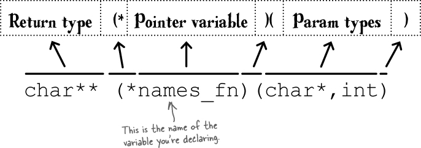
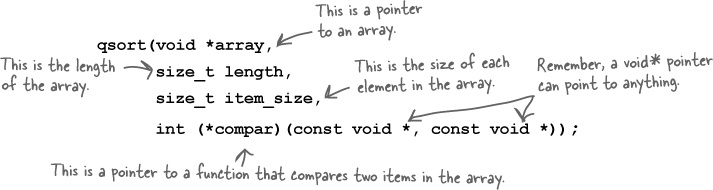
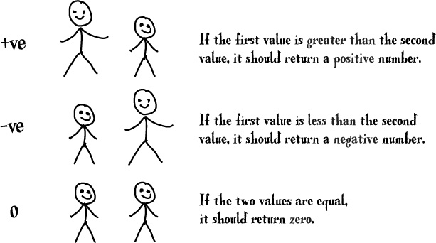
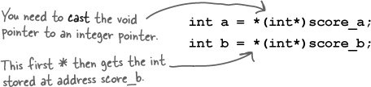
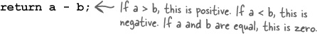
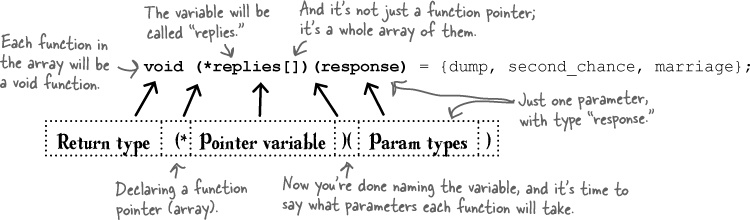
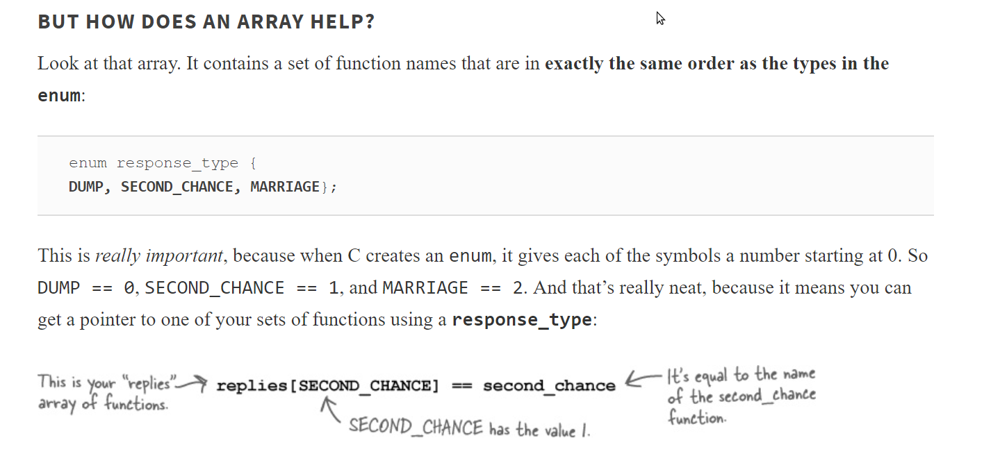
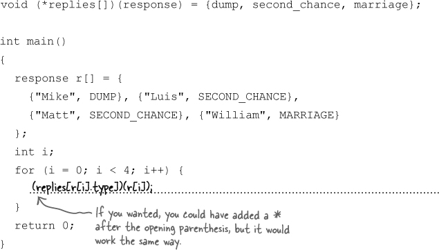
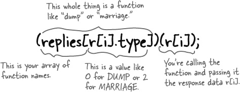
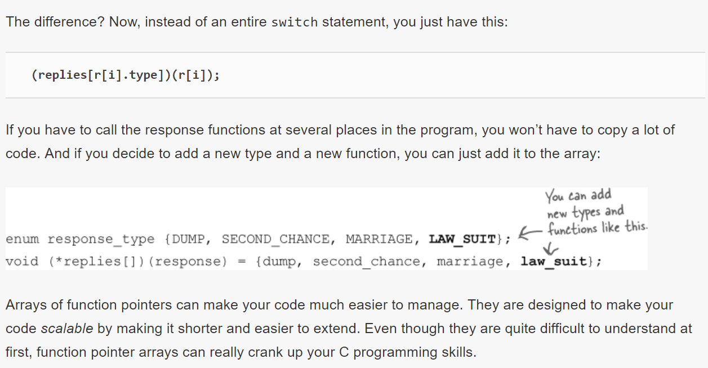

# Function Pointers



### Func Pointer Example from Standard Library
* The qsort() function compares pairs of values over and over again, and if they are in the wrong order, the computer will switch them.
  

### Comparator Function


### SORTING INTS UP CLOSE

```c
int scores[] = {543,323,32,554,11,3,112};

int compare_scores(const void* score_a, const void* score_b)

{
  
...

}

```

* Values are always passed to the function as pointers, so the first thing you need to do is get the integer values from the pointers:
  
  
* Then you need to return a positive, negative, or zero value, depending on whether a is greater than, less than, or equal to b.
  
  
* And this is how you ask qsort() to sort the array:
```c
qsort(scores, 7, sizeof(int), compare_scores);
```
## Func Pointer  Array











## Bullet Points

* Function pointers store the addresses of functions.

* The name of each function is actually a function pointer.

* If you have a function shoot(), then shoot and &shoot are both pointers to that function.

* You declare a new function pointer with return-type(*var-name)(param-types).

* If fp is a function pointer, you can call it with fp(params, ...).

* Or, you can use (*fp)(params,...). C will work the same way.

* The C Standard Library has a sorting function called qsort().

* qsort() accepts a pointer to a comparator function that can test for (in)equality.

* The comparator function will be passed pointers to two items in the array being sorted.

* If you have an array of data, you can associate functions with each data item using function pointer arrays.