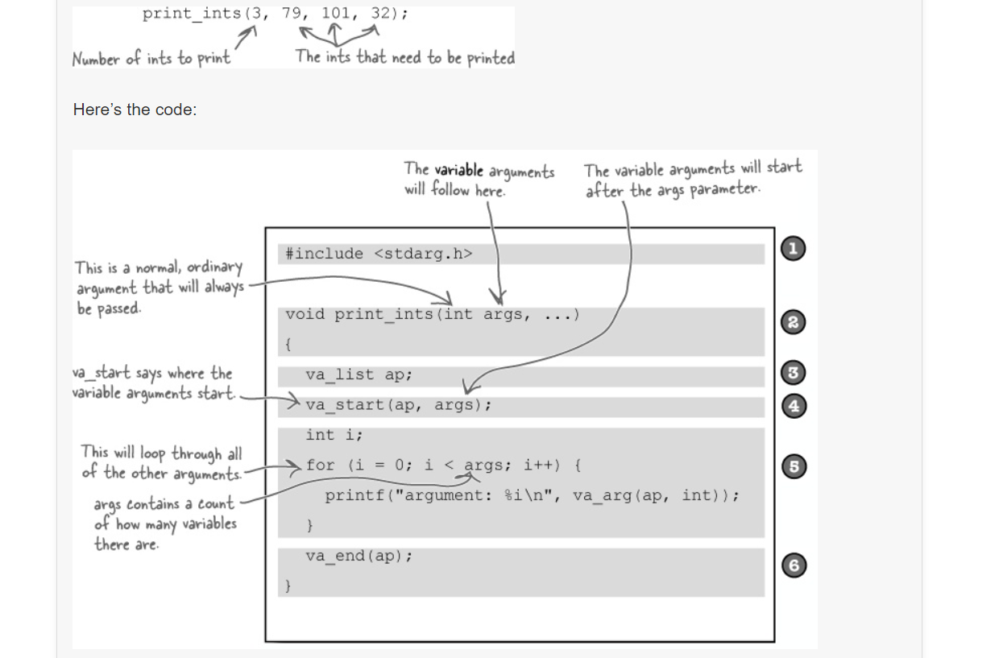
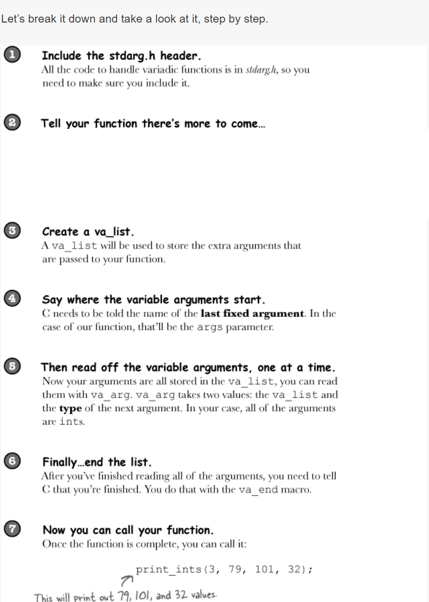

# Variadic Functions

# BULLET POINTS

* Functions that accept a variable number of arguments are called variadic functions.

* To create variadic functions, you need to include the stdarg.h header file.

* The variable arguments will be stored in a va_list.

* You can control the va_list using va_start(), va_arg(), and va_end().

* You will need at least one fixed parameter.

* Be careful that you don’t try to read more parameters than you’ve been given.

* You will always need to know the data type of every parameter you read.