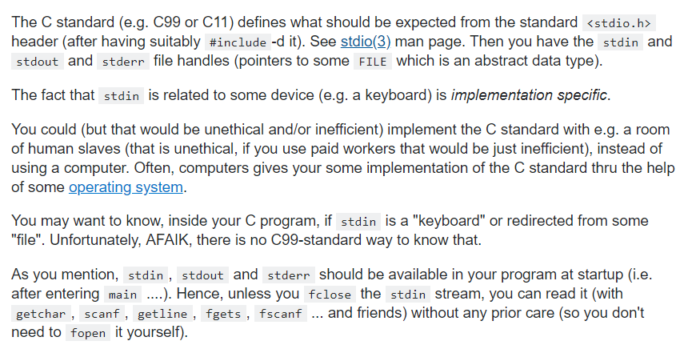
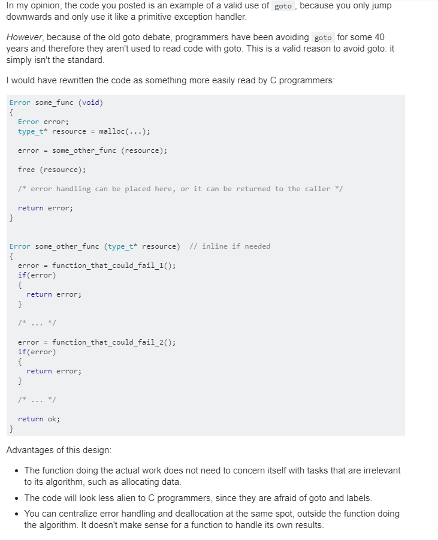

# Good Questions and If possible Answers and Examples of them

[What is Standard Input and Output](https://stackoverflow.com/questions/19540425/what-is-standard-input)

[ STDIO Man Pages ~ stdin | stdout ](http://man7.org/linux/man-pages/man3/stdio.3.html)

---

[Can we us goto in C for the purpose of replacing try catch blocks in java](https://softwareengineering.stackexchange.com/questions/154974/is-this-a-decent-use-case-for-goto-in-c)
          

---

