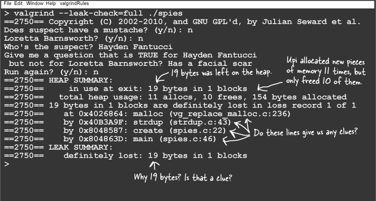
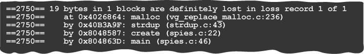
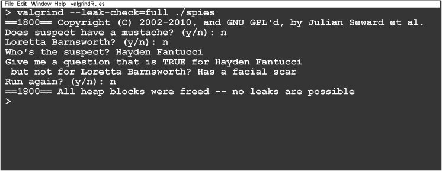

# Valgrind

* valgrind checks for memory leaks.
* valgrind works by intercepting the calls to malloc() and free().
* When a program stops running, valgrind prints details of what’s left on the heap.
* If you compile your code with debug information, valgrind can give you more information.
* If you run your program several times, you can narrow the search for the leak.
* Valgrind can tell you which lines of code in your source put the data on the heap.
* valgrind can be used to check that you’ve fixed a leak.

## Valgrind Usage
* first compile the code with -g flag to make sure your executable contains debug information.
  ```bash
  gcc -g code.c -o code
  ```

* You’ll start valgrind on the command line with the --leak-check=full option and then pass it the program you want to r
un
  ```bash
  valgrind --leak-check=full ./code
  ```
* let's check the program


* We use this info to fix the issue
    *  it tells you which lines of code in your source put the data on the heap.
    * and other the places where this non-freed data used.


* We fixed the issue, no leak.


## Bullet Points
