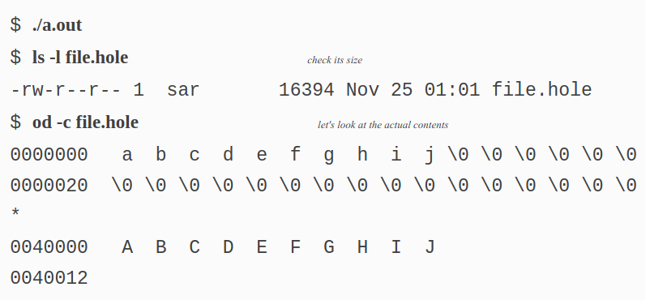
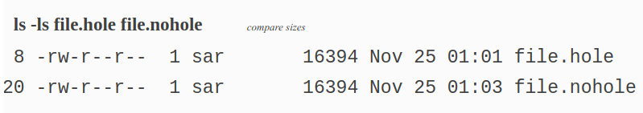
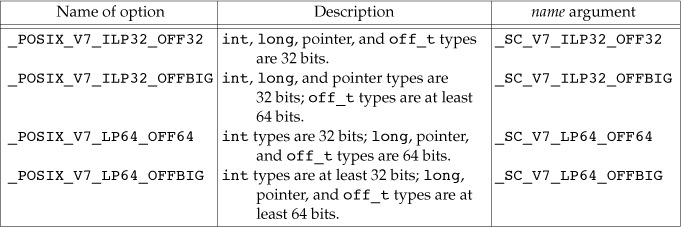
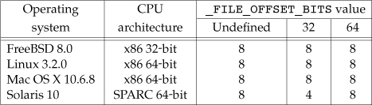

# Unbuffered I/O

## FILE DESCRIPTORS

* To the kernel, all open files are referred to by file descriptors. 

* A file descriptor is a non-negative integer. 

* When we open an existing file or create a new file, the kernel returns a file descriptor to the process.

```c
#include<unistd.h>
STDIN_FILENO  	// 0
STDOUT_FILENO 	// 1
STDERR_FILENO   // 2
```

* File descriptors range from 0 through **OPEN_MAX**–1.

* With FreeBSD 8.0, Linux 3.2.0, Mac OS X 10.6.8, and Solaris 10, the limit is essentially infinite, bounded by the amount of memory on the system, the size of an integer, and any hard and soft limits configured by the system administrator.

## OPEN AND OPENAT FUNCTIONS

A file is opened or created by calling either the open function or the openat function.

```c
#include<fcntl.h>

int open(const char* path, int oflag, .../* mode_t mode */);
int openat(int fd, const char* path, int oflag, .../* mode_t mode */);

// Both return: file descriptor if OK, –1 on error
```

* We show the last argument as ..., which is the ISO C way to specify that the number and types of the remaining arguments may vary. 

* For these functions, the last argument is used only when a new file is being created

* The path parameter is the name of the file to open or create.

* This function has a multitude of options, which are specified by the oflag argument.

---

## oflag argument

* This argument is formed by ORing together one or more of the following constants from the `<fcntl.h>` header:

```c
#include<fcntl.h>

O_RDONLY   // Open for reading only. By Convention 0
O_WRONLY   // Open for writing only. By Convention 1
O_RDWR 	   // Open for reading and writing. By Convention 2
O_EXEC     // Open for execute only.
   
/* One and only one of the previous four constants must be specified.  */

```

### Optional oflag arguments

```c
#include<fcntl.h>

O_APPEND	// Append to the end of the file on each write
O_CLOEXEC 	// Set the FD_CLOEXEC file descriptor flag.

O_CREAT		// Create the file if it doesn’t exist. 
// O_CREAT requires a third argument to the open function (a fourth argument to the openat function) — the mode, which specifies the access permission bits of the new file.

O_DIRECTORY 	// Generate an error if path doesn't refer to a directory.

O_EXECL		// Generate an error if O_CREAT is also specified and the file already exists.
// P_EXECL test for whether the file already exists and the creation of the file if it doesn’t exist is an atomic operation.

O_NOCTTY	// If path refers to a terminal device, do not allocate the device as the controlling terminal for this process.
O_NOFOLLOW	// Generate an error if path refers to a symbolic link. 

O_NONBLOCK	// If path refers to a FIFO, a block special file, or a character special file, O_NONBLOCK option sets the nonblocking mode for both the opening of the file and subsequent I/O. 

O_SYNC		// Have each write wait for physical I/O to complete, including I/O necessary to update file attributes modified as a result of the write. 

O_TRUNC		// If the file exists and if it is successfully opened for either write-only or read–write, truncate its length to 0.

O_TTY_INIT	// When opening a terminal device that is not already open, set the nonstandard termios parameters to values that result in behavior that conforms to the SUS.

/* The following two flags are also optional. 
 * They are part of the synchronized input and output option of the SUS (and thus POSIX.1). 
 */

O_DSYNC		// Have each write wait for physical I/O to complete, but don’t wait for file attributes to be updated if they don’t affect the ability to read the data just written.

O_RSYNC 	// Have each read operation on the file descriptor wait until any pending writes for the same portion of the file are complete.
// Linux 3.2.0 supports the O_DSYNC flag, but treats the O_RSYNC flag the same as O_SYNC.

```

* The O_DSYNC and O_SYNC flags are similar, but subtly different. 
  * The O_DSYNC flag affects a file’s attributes only when they need to be updated to reflect a change in the file’s data (for example, update the file’s size to reflect more data). 
  * With the O_SYNC flag, data and attributes are always updated synchronously. 
  * When overwriting an existing part of a file opened with the O_DSYNC flag, the file times wouldn’t be updated synchronously. 
  * In contrast, if we had opened the file with the O_SYNC flag, every write to the file would update the file’s times before the write returns, regardless of whether we were writing over existing bytes or appending to the file.

---


* The file descriptor returned by open and openat is guaranteed to be the lowest-numbered unused descriptor.

* The fd parameter distinguishes the openat function from the open function. There are three possibilities:

1. The path parameter specifies an absolute pathname. 
  * In this case, the fd parameter is ignored and the openat function behaves like the open function.

2. The path parameter specifies a relative pathname and the fd parameter is a file descriptor that specifies the starting location in the file system where the relative pathname is to be evaluated.
  * The fd parameter is obtained by opening the directory where the relative pathname is to be evaluated.

3. The path parameter specifies a relative pathname and the fd parameter has the special value AT_FDCWD.
  * In this case, the pathname is evaluated starting in the current working directory and the openat function behaves like the open function.

---

The openat function is one of a class of functions added to the latest version of POSIX.1 to address two problems.

1. It gives threads a way to use relative pathnames to open files in directories other than the current working directory.

2. It provides a way to avoid time-of-check-to-time-of-use (TOCTTOU) errors.

* The basic idea behind **TOCTTOU** errors is that a program is vulnerable if it makes two file-based function calls where the second call depends on the results of the first call. Because the two calls are not atomic, the file can change between the two calls, thereby invalidating the results of the first call, leading to a program error. 

--- 

### Filename and Pathname Truncation

* With POSIX.1, the constant _POSIX_NO_TRUNC determines whether long filenames and long components of pathnames are truncated or an error is returned.
  * We can use **fpathconf** or **pathconf** to query a directory to see which behavior is supported.

If _POSIX_NO_TRUNC is in effect, errno is set to ENAMETOOLONG, and an error status is returned if any filename component of the pathname exceeds NAME_MAX.


* Most modern file systems support a maximum of 255 characters for filenames. 

## CREAT Function

A new file can also be created by calling the creat function.

```c
#include<fcntl.h>

int creat(const char* path, mode_t mode);

// Returns: file descriptor opened for write-only if OK, –1 on error
```

* This function equivalent to

```c
open(path, O_WRONLY | O_CREAT | O_TRUNC, mode);
```

* One deficiency with creat is that the file is opened only for writing.

* Before the new version of open was provided, if we were creating a temporary file that we wanted to write and then read back, we had to call creat, close, and then open. 

* A better way is to use the open function, as in

```c
open(path, O_RDRW | O_CREAT | O_TRUNC, mode);
```

## CLOSE Function

```c
#include<unistd.h>
int close(int fd);

// Returns 0 if OK, -1 on error
```

* Closing a file also releases any record locks that the process may have on the file.

* When a process terminates, all of its open files are closed automatically by the kernel. 
  * Many programs take advantage of this fact and don’t explicitly close open files.

## LSEEK Function

* Every open file has an associated “current file offset,” normally a non-negative integer that measures the number of bytes from the beginning of the file.

* Read and write operations normally start at the current file offset and cause the offset to be incremented by the number of bytes read or written. 

* By default, this offset is initialized to 0 when a file is opened, unless the O_APPEND option is specified.


```c
#include<unistd.h>

off_t lseek(int fd, off_t offset, int whence);

// Returns: new file offset if OK, -1 on error
```

* The interpretation of the offset depends on the value of the whence argument.
  * If whence is SEEK_SET, the file’s offset is set to offset bytes from the beginning of the file.
  * If whence is SEEK_CUR, the file’s offset is set to its current value plus the offset. The offset can be positive or negative.
  * If whence is SEEK_END, the file’s offset is set to the size of the file plus the offset. The offset can be positive or negative.

* Because a successful call to lseek returns the new file offset, we can seek zero bytes from the current position to determine the current offset:

```c
off_t currPosition;
currPosition = lseek(fd, 0, SEEK_CUR);
```

* This technique can also be used to determine if a file is capable of seeking. 
  * If the file descriptor refers to a **pipe**, **FIFO**, or **socket**, lseek sets errno to **ESPIPE** and returns –1.

* The character l in the name lseek means “long integer.”

* Normally, a file’s current offset must be a non-negative integer. 
  * It is possible, however, that certain devices could allow negative offsets. 
  * But for regular files, the offset must be non-negative. 
  * Because negative offsets are possible, we should be careful to compare the return value from lseek as being equal to or not equal to –1, rather than testing whether it is less than 0.

* Because the offset (off_t) is a signed data type we lose a factor of 2 in the maximum file size. 
  * If off_t is a 32-bit integer, the maximum file size is 2<sup>31</sup>–1 bytes.

* lseek only records the current file offset within the kernel—it does not cause any I/O to take place. This offset is then used by the next read or write operation.

* The file’s offset can be greater than the file’s current size, in which case the next write to the file will extend the file. 
  * This is referred to as **creating a hole in a file** and is allowed. 
  * Any bytes in a file that have not been written are read back as 0.

* A hole in a file isn’t required to have storage backing it on disk. 
  * Depending on the file system implementation, when you write after seeking past the end of a file, new disk blocks might be allocated to store the data, 
  * but there is no need to allocate disk blocks for the data between the old end of file and the location where you start writing.

```c
#include<stdio.h>
#include<stdlib.h>
#include<unistd.h>
#include<fcntl.h>

char    buf1[] = "abcdefghij";
char    buf2[] = "ABCDEFGHIJ";

int
main(void)
{
    int     fd;

    if ((fd = creat("file.hole", FILE_MODE)) < 0)
        err_sys("creat error");

    if (write(fd, buf1, 10) != 10)
        err_sys("buf1 write error");
    /* offset now = 10 */

    if (lseek(fd, 16384, SEEK_SET) == -1)
        err_sys("lseek error");
    /* offset now = 16384 */

    if (write(fd, buf2, 10) != 10)
        err_sys("buf2 write error");
    /* offset now = 16394 */

    exit(0);
}
```



* We use the **od command** to look at the contents of the file. The -c flag tells it to print the contents as characters.



* Although both files are the same size, the file without holes consumes 20 disk blocks, whereas the file with holes consumes only 8 blocks.


* Because the offset address that lseek uses is represented by an off_t, implementations are allowed to support whatever size is appropriate on their particular platform.
  * Most platforms today provide two sets of interfaces to manipulate file offsets: one set that uses 32-bit file offsets and another set that uses 64-bit file offsets.

* The SUS provides a way for applications to determine which environments are supported through the sysconf function. Image summarizes the sysconf constants that are defined.
  

* Figure summarizes the size in bytes of the off_t data type for the platforms covered in this book when an application doesn’t define _FILE_OFFSET_BITS, as well as the size when an application defines _FILE_OFFSET_BITS to have a value of either 32 or 64.



* Note that even though you might enable 64-bit file offsets, your ability to create a file larger than 2 GB (2<sup>31</sup>–1 bytes) depends on the underlying file system type.

## READ Function

Data is read from an open file with the read function.

```c
#include<unistd.h>

ssize_t read(int fd, void* buf, size_t nbytes);  // ssize_t = signed size_t

// Returns: number of bytes read, 0 if end of file, –1 on error
```

If the read is successful, the number of bytes read is returned. If the end of file is encountered, 0 is returned.


* There are several cases in which the number of bytes actually read is less than the amount requested:

  * When reading from a regular file, if the end of file is reached before the requested number of bytes has been read. 
    * For example, if 30 bytes remain until the end of file and we try to read 100 bytes, read returns 30. The next time we call read, it will return 0  

  * When reading from a terminal device. Normally, up to one line is read at a time.

  * When reading from a network. Buffering within the network may cause less than the requested amount to be returned.

  * When reading from a pipe or FIFO. If the pipe contains fewer bytes than requested, read will return only what is available.

  * When reading from a record-oriented device. Some record-oriented devices, such as magnetic tape, can return up to a single record at a time. 
  
  * When interrupted by a signal and a partial amount of data has already been read. 

* The read operation starts at the file’s current offset. 
  * Before a successful return, the offset is incremented by the number of bytes actually read. 

* POSIX.1 changed the prototype for this function in several ways. The classic definition is
  ```c
    int read(int fd, char* buf, unsigned nbytes);
  ```
  
  * First, the second argument was changed from char * to void * to be consistent with ISO C: the type void * is used for generic pointers.

  * Next, the return value was required to be a signed integer (ssize_t) to return a positive byte count, 0 (for end of file), or –1 (for an error).

  * Finally, the third argument historically has been an unsigned integer, to allow a 16-bit implementation to read or write up to 65,534 bytes at a time. 
    *  With the 1990 POSIX.1 standard, the primitive system data type **ssize_t** was introduced to provide the signed return value, and the unsigned size_t was used for the third argument.  

